<center><h1> Delta K - WRO 2025 Future Engineers </h1></center>

<!-- ⚠️⚠️⚠️ REMINDER: ADD TEAM BANNER IMAGE HERE ⚠️⚠️⚠️ -->
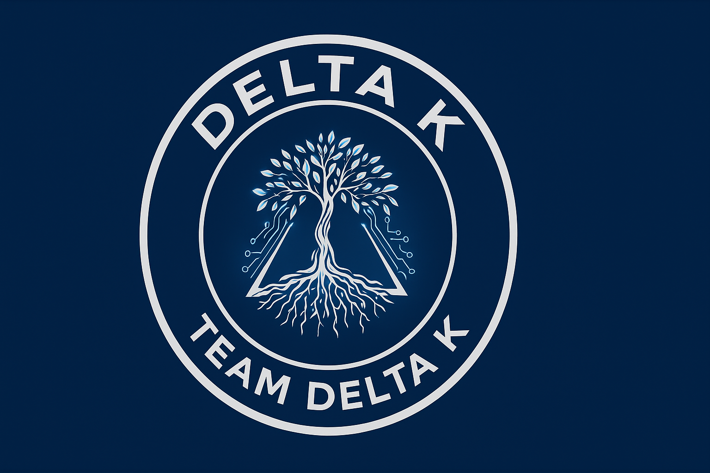

[](#)

This repository contains the complete documentation for Team Delta K's autonomous robot for the 2025 World Robot Olympiad Future Engineers competition. Delta Bot was designed, built, and programmed by three dedicated students from Karachi, Pakistan, representing Haque Academy on the international stage.

## Table of Contents
* [The Team](#team)
* [The Challenge](#challenge)
* [The Robot](#robot-image)
* [Performance Video](#video)
* [Development Journey](#development-journey)
* [Mobility Management](#mobility-management)
  * [Custom Motor Design](#custom-motor-design)
  * [Steering System](#steering-system)
  * [Drivetrain](#drivetrain)
  * [Chassis](#chassis)
  * [Wheels](#wheels)
* [Power and Sense Management](#power-and-sense-management)
  * [Raspberry Pi 5](#raspberry-pi-5)
  * [XRP Controller Board](#xrp-board)
  * [Vision System - PiCam2](#picam2)
  * [RPLidar A2M12](#rplidar)
  * [LSM6DSOX IMU](#imu-sensor)
  * [HC-SR04 Ultrasonic Sensor](#ultrasonic)
  * [Motor Encoder](#motor-encoder)
  * [Power System](#power-system)
  * [Circuit Diagram](#circuit-diagram)
* [Software Architecture](#software-architecture)
  * [Code Structure](#code-structure)
  * [Computer Vision](#computer-vision)
  * [Sensor Fusion](#sensor-fusion)
  * [Communication Protocol](#communication)
* [Obstacle Management](#obstacle-management)
  * [Qualification Round Strategy](#quali-strategy)
  * [Obstacle Round Strategy](#obstacle-strategy)
  * [Parking Challenge](#parking-challenge)
* [Code Implementation](#code-implementation)
  * [Main Control Loop](#main-loop)
  * [LiDAR Mapping](#lidar-code)
  * [Color Detection](#color-detection-code)
  * [IMU Integration](#imu-code)
  * [Motor Control](#motor-control-code)
  * [Obstacle Avoidance](#obstacle-avoidance-code)
* [Robot Construction Guide](#robot-construction-guide)
* [Cost Report](#cost-report)
* [Testing & Results](#testing-results)
* [Future Improvements](#future-improvements)
* [Acknowledgments](#acknowledgments)
* [Resources](#resources)
* [License](#license)

---

## The Team <a class="anchor" id="team"></a>

<!-- ⚠️⚠️⚠️ REMINDER: ADD ALL TEAM MEMBER PHOTOS IN ./team-photos/ FOLDER ⚠️⚠️⚠️ -->

### Kabir - Project Manager & Documentation Lead
<p align="center">
  
</p>

**Age:** 15

**School:** Haque Academy, Karachi, Pakistan

**Role:** Project Manager & Documentation Lead

**Description:** Hi! I'm Kabir, and I'm passionate about programming, public speaking, leadership, and staying fit through gymming. WRO 2025 represents an incredibly interesting challenge and a golden opportunity to showcase our robotics skills on the international stage. My strengths lie in organizing the team, maintaining comprehensive documentation, managing our GitHub repository, and planning the robot's development roadmap. I previously qualified at the national level for the International Robot Olympiad (IRO) in Greece, which gave me valuable competition experience. What I enjoy most about my role is seeing our robot's progress grow in real-time—watching our ideas transform from sketches to a fully functional autonomous vehicle is incredibly rewarding. Leading this team and documenting every step of our journey has taught me that success comes from meticulous planning, clear communication, and relentless dedication to improvement.

---

### Kosain - Lead Programmer
<p align="center">
  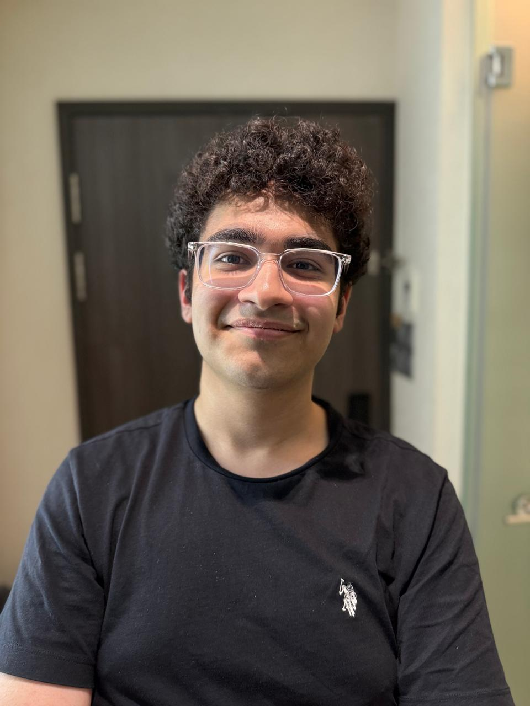
</p>

**Age:** 16

**School:** Haque Academy, Karachi, Pakistan

**Role:** Lead Programmer

**Description:** Hello! I'm Kosain, the lead programmer for Team Delta K. I've been fascinated by programming since I was 6 or 7 years old—what drew me in was how extremely logical it is, and my school provided many opportunities to learn and grow. Over the years, I've become proficient in Python, C, C++, C#, HTML, CSS, and JavaScript. I've worked on diverse projects including wireless remote control protocols, AI frontend development, image editor software built on ESP32, an electronic dice, a formula calculator, and even a malware debunker tool. What I love most about programming is its pure logic—every problem has a solution if you think systematically. Beyond software, I have a strong interest in the hardware side of things, which is why robotics is the perfect blend of my passions. For this competition, I'm handling all the computer vision, sensor integration, and control algorithms that bring Delta Bot to life. The challenge of making real-time decisions based on multiple sensor inputs is exactly the kind of complex problem I thrive on solving.

---

### Rayyan - Lead Hardware & Construction
<p align="center">
  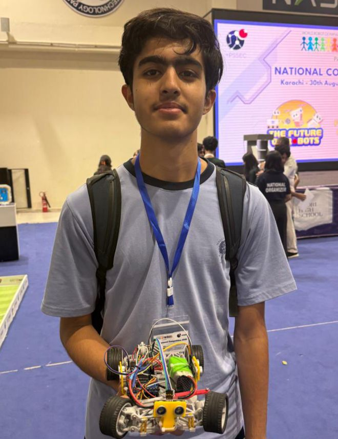
</p>

**Age:** 15

**School:** Haque Academy, Karachi, Pakistan

**Role:** Lead Hardware & Construction


**Description:** Hi ! I’m Rayyan, I have been passionate about robotics, engineering, and hands-on building for as long as I can remember. My STEM journey began with the First LEGO League Junior National Competition in 2019, and since then I’ve developed strong skills in 3D printing, CAD design, and mechanical construction. I’m especially fascinated by gears, linkages, and structural integrity, and I love modifying and customizing RC cars into high-speed performance builds.
As the Lead Hardware & Construction member of Team Delta K, I designed, assembled, and 3D-printed our autonomous robot for the WRO Future Engineers category. My interest in fabrication also inspired me to co-found @rk3dprints, where my teammate and I create innovative 3D-printed products.
Outside robotics, I enjoy fishing, building natural habitat aquariums, rowing as Captain of my school’s team, and exploring culinary arts. I’m excited to gain international exposure at WRO 2025 and take my passion for innovation to the global stage.

---

### Ali Saif - Coach
<p align="center">
  
</p>

**Role:** Team Coach

**Description:** Leveraging a robust engineering background, Ali Saif is an entrepreneur dedicated to solving challenging market problems through innovation. He combine technical rigor with business acumen to build and grow companies that are disrupting the technology landscape.
 

---

### Team Photo
<p align="center">
  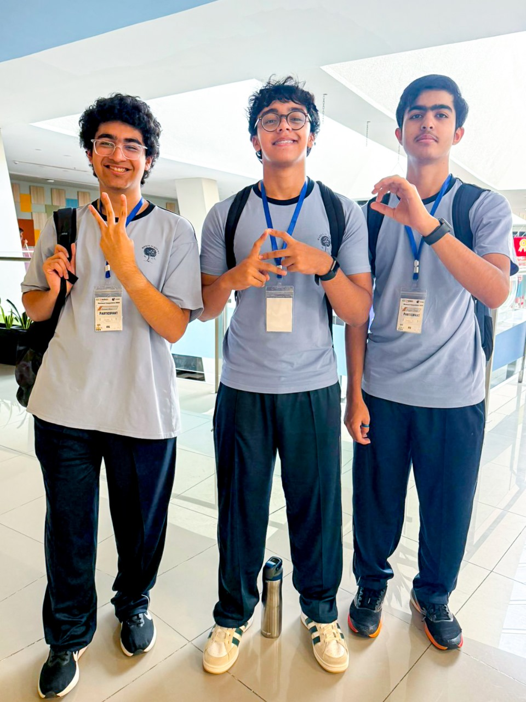
</p>

<!-- ⚠️⚠️⚠️ REMINDER: ADD TEAM FORMATION STORY & DYNAMICS ⚠️⚠️⚠️ -->
<!-- Include: How the team formed, how you knew each other, why you decided to work together, team dynamic, how you divide work, resolve disagreements, memorable moments during development -->

**Team Formation:** [Describe how Delta K was formed, how team members knew each other beforehand, what brought you together for WRO, and what makes your team dynamic special]

**Team Dynamic:** [Explain how you work together, divide responsibilities, handle disagreements, celebrate successes, and any funny or memorable moments during the 6-month development process]

---

## The Challenge <a class="anchor" id="challenge"></a>

The **[WRO 2025 Future Engineers - Self-Driving Cars](https://wro-association.org/)** challenge represents the pinnacle of student robotics competitions, inviting teams worldwide to design, build, and program fully autonomous vehicles. The competition simulates real-world self-driving car scenarios with three distinct challenges:

**1. Open Challenge (Qualification Round):** Robots must autonomously navigate a track with randomly placed walls, completing three laps in the fastest time possible. The direction of travel (clockwise or counterclockwise) is determined by detecting colored lines (orange or blue) at the track's corners.

**2. Obstacle Challenge (Final Round):** Building on the qualification round, robots must now avoid randomly placed traffic signs (red and green pillars) while maintaining speed and efficiency. The challenge includes a mandatory U-turn rule: if the last obstacle in the second lap is red, the robot must turn around and complete the final lap in the opposite direction.

**3. Parking Challenge:** After completing the obstacle rounds, robots must identify a parking space marked by magenta walls and execute a precise parallel parking maneuver.

**Key Technical Requirements:**
- **Mobility Management:** Efficient motor control, precise steering, and robust mechanical design
- **Sensor Fusion:** Integration of multiple sensors (camera, LiDAR, IMU, encoders) for environmental awareness
- **Computer Vision:** Real-time color detection and object recognition for obstacles and parking spaces
- **Path Planning:** Dynamic navigation using sensor data to avoid collisions and optimize routes
- **Documentation:** Comprehensive engineering documentation in a public GitHub repository demonstrating the entire development process

**Scoring Criteria:**
- Performance in competition rounds (speed, accuracy, obstacle avoidance)
- Quality and completeness of engineering documentation
- Innovation in design and problem-solving approaches
- Team presentation and ability to explain technical decisions

This challenge emphasizes the complete engineering process—from conceptual design through iterative prototyping, testing, and final implementation. It pushes teams to integrate mechanical engineering, electronics, computer science, and project management skills while fostering creativity, teamwork, and resilience in the face of technical challenges.

Learn more about the WRO 2025 challenge rules and specifications [here](https://wro-association.org/competition/season-2025/).

---

## Photos of Our Robot: Delta Bot <a class="anchor" id="robot-image"></a>

<!-- ⚠️⚠️⚠️ REMINDER: ADD ALL SIX ROBOT PHOTOS (front, back, left, right, top, bottom) IN ./robot-photos/ FOLDER ⚠️⚠️⚠️ -->

Delta Bot represents our team's sixth month of intensive engineering, combining cutting-edge sensors with custom mechanical solutions. Powered by a Raspberry Pi 5 and equipped with RPLidar for 360-degree environmental mapping, Delta Bot achieves autonomous navigation through advanced sensor fusion and real-time path planning.

| Front View | Back View | 
| :--: | :--: | 
|  |  |
| **Left View** | **Right View** |
|  |  |
| **Top View** | **Bottom View** |
|  |  |

<!-- ⚠️⚠️⚠️ REMINDER: ADD ROBOT SPECIFICATIONS TABLE ⚠️⚠️⚠️ -->
<!-- ⚠️⚠️⚠️ REMINDER: MEASURE AND ADD ROBOT WEIGHT ⚠️⚠️⚠️ -->
<!-- ⚠️⚠️⚠️ REMINDER: MEASURE AND ADD ROBOT DIMENSIONS (Length x Width x Height) ⚠️⚠️⚠️ -->

**Key Specifications:**
- **Dimensions:** [Length] cm x [Width] cm x [Height] cm
- **Weight:** ~1 KG
- **Brain:** Raspberry Pi 5 (8-core CPU, 8GB RAM)
- **Vision:** PiCam2 with OpenCV processing
- **Mapping:** RPLidar A2M12 (360° scanning, 12m range)
- **Navigation:** LSM6DSOX IMU (6-axis gyroscope + accelerometer)
- **Drive System:** Custom dual-axle motor with DG01D-E encoder
- **Steering:** SG90 micro servo with parallel linkage mechanism
- **Power:** 3x 1500mAh LiPo batteries with voltage regulation
- **Construction:** 30+ 3D printed PLA+ components

---

## Our Performance Video <a class="anchor" id="video"></a>

<!-- ⚠️⚠️⚠️ REMINDER: UPLOAD COMPETITION/TESTING VIDEO TO YOUTUBE AND ADD LINK HERE ⚠️⚠️⚠️ -->

Watch Delta Bot in action [here](https://https://google.com)
**(link to youtube video has yet to be added)**

**Competition Performance Highlights:**
- **Qualification Round Best Time:** 14 seconds
- **Obstacle Round Score:** 10.0 (14 points)
- **National Competition Result:** 3rd Place (Qualified for International Competition)

---

## Development Journey <a class="anchor" id="development-journey"></a>

Delta Bot's development spanned six months and four major design iterations, each addressing critical challenges and pushing our capabilities further.

### **Iteration 1: The Arduino Attempt (Month 1)**
Our first design used an Arduino Uno as the main controller with basic ultrasonic sensors for navigation. We quickly discovered the Arduino's limitations:
- **Camera compatibility** was extremely unstable and unreliable
- **Color sensors** proved inadequate for the obstacle challenge—they couldn't reliably distinguish between red and green traffic signs
- **Processing power** was insufficient for real-time decision-making

**Lesson Learned:** Budget hardware severely limits autonomous capabilities. Vision and processing power are non-negotiable for competition-level performance.

### **Iteration 2: Raspberry Pi 4 with Ambition (Months 2-3)**
We upgraded to a Raspberry Pi 4, expecting significant improvements. Instead, we encountered our biggest setback:
- **Camera communication** took nearly a month to debug—the Pi 4 struggled with consistent PiCam integration
- **LiDAR data overload**—the RPLidar A2M12 generates massive amounts of data, completely overwhelming the Pi 4's processing capabilities
- The robot would freeze or make delayed decisions, making it completely uncompetitive

**Breakthrough Moment:** We realized we needed significantly more processing power, not just incremental upgrades.

### **Iteration 3: The Raspberry Pi 5 Revolution (Month 4)**
Switching to the Raspberry Pi 5 transformed our project:
- **8-core processor** effortlessly handled LiDAR data, camera processing, and navigation algorithms simultaneously
- **Improved camera support** eliminated communication issues entirely
- **Real-time performance** finally achieved—Delta Bot could process sensor data and react within milliseconds

This upgrade was expensive but absolutely critical to our success.

### **Iteration 4: Mechanical Refinement & Custom Motor (Months 5-6)**
With electronics stable, we focused on mechanical optimization:
- **30+ 3D printed parts:** Designed and refined chassis, motor mounts, sensor holders, and linkages
- **Weight optimization:** Iterative printing reduced unnecessary material while maintaining structural integrity
- **Parallel linkage steering:** Achieved reliable, precise steering without complex Ackermann geometry

### **Crisis at Nationals**
Just before the obstacle round at WRO Pakistan Nationals, disaster struck: ultrasonic sensor wiring short-circuited, melting the wires. With only minutes before our run, the team had to:
1. Quickly strip and reconnect all ultrasonic sensor wiring
2. Test functionality without time for proper debugging
3. Compete with hastily repaired electronics

Despite this setback, Delta Bot placed **3rd nationally** and qualified for the **international competition**—a testament to the robot's robust design and the team's ability to perform under extreme pressure.

### **Key Takeaways:**
- **Start with sufficient processing power**—upgrading mid-project wastes time
- **Plan for redundancy**—backup sensors and modular wiring saved us at nationals
- **Document everything**—clear documentation allowed rapid troubleshooting
- **Iterate relentlessly**—each failure taught us what really matters in autonomous robotics

---

# Mobility Management <a class="anchor" id="mobility-management"></a>

Delta Bot's mobility system is the result of extensive iteration and custom engineering. After testing multiple motor configurations and steering mechanisms, we developed a unique dual-axle drivetrain that maximizes encoder precision while maintaining a compact footprint.

## Custom Motor Design <a class="anchor" id="custom-motor-design"></a>

<!-- ⚠️⚠️⚠️ REMINDER: ADD IMAGES OF CUSTOM MOTOR ASSEMBLY ⚠️⚠️⚠️ -->
<!-- Include: Disassembled motor photos, encoder integration photos, dual-axle configuration photos -->
<p align="center">
  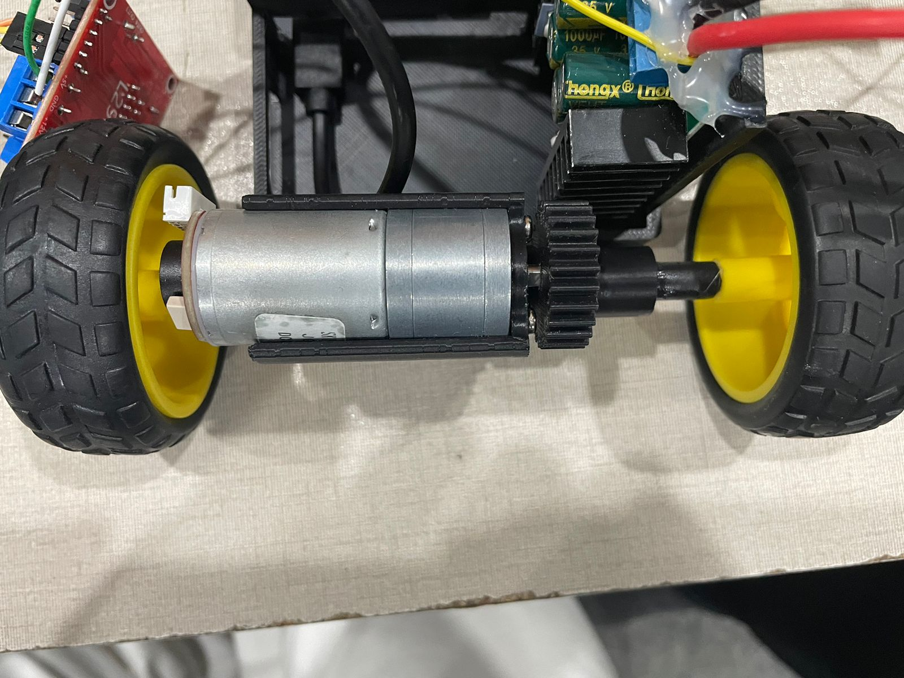
</p>

### Design Philosophy

Off-the-shelf motors with encoders couldn't meet our specific requirement: the motor needed to physically sit **between** the two rear wheels, with the axle passing through both sides. This configuration was essential for:
- **Balanced weight distribution** across the rear axle
- **Direct mechanical connection** to both wheels without complex differential systems
- **Precise encoder feedback** for accurate distance measurement
- **Compact chassis design** by centralizing the motor

### Custom Modifications

Starting with a **TT Motor Yellow Geared DC Motor body**, we performed the following modifications:

1. **Motor Disassembly:** Carefully disassembled the motor casing to access the internal shaft
2. **Encoder Integration:** Integrated the **DG01D-E Motor Encoder** directly onto the motor shaft for absolute position tracking
3. **Dual-Axle Slots:** Machined slots on both sides of the motor housing to allow the axle to pass completely through
4. **Reassembly with Precision:** Reassembled the motor with the encoder securely mounted, ensuring no mechanical play

<!-- ⚠️⚠️⚠️ REMINDER: ADD 3D MODEL/BLUEPRINT OF CUSTOM MOTOR MOUNTING SYSTEM ⚠️⚠️⚠️ -->

**Technical Specifications:**
- **Base Motor:** TT Motor Yellow Geared DC Motor
- **Encoder:** DG01D-E (quadrature encoder for precise position feedback)
- **Gear Ratio:** [Add gear ratio]
- **Operating Voltage:** 6-12V
- **Configuration:** Dual-axle pass-through design
- **Mounting:** Custom 3D printed motor mounts

### Why This Matters

The custom motor design eliminates the need for a differential while providing:
- **Encoder precision:** Real-time wheel position feedback accurate to fractions of a degree
- **Direct drive efficiency:** No power loss through gears or belts
- **Simplified control:** Both rear wheels are mechanically locked together, simplifying motor control algorithms
- **Compact footprint:** The motor doesn't protrude from the chassis, reducing overall robot size

<!-- ⚠️⚠️⚠️ REMINDER: ADD 3D PRINTED MOTOR MOUNT BLUEPRINTS ⚠️⚠️⚠️ -->

---

## Steering System <a class="anchor" id="steering-system"></a>

<!-- ⚠️⚠️⚠️ REMINDER: ADD STEERING MECHANISM PHOTOS AND DIAGRAMS ⚠️⚠️⚠️ -->
<p align="center">
  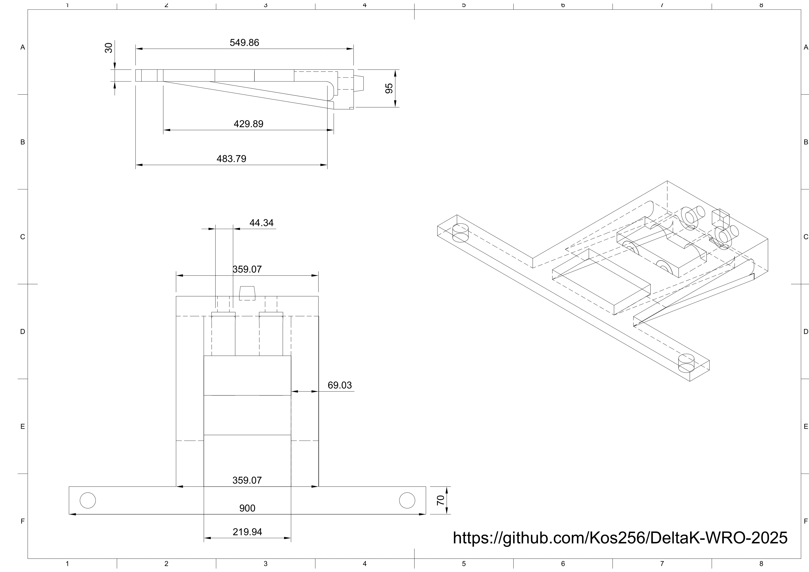
</p>

### Parallel Linkage Design

After experimenting with Ackermann steering and direct servo-to-wheel connections, we settled on a **parallel linkage mechanism** for its simplicity, reliability, and sufficient turning radius.
<p align="center">
   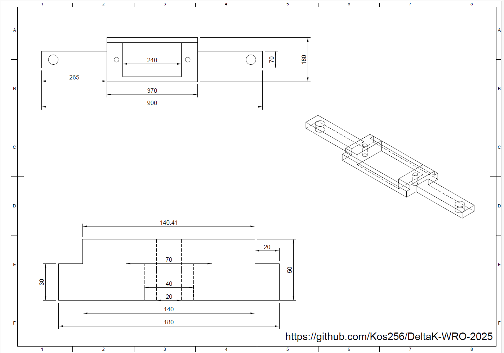
   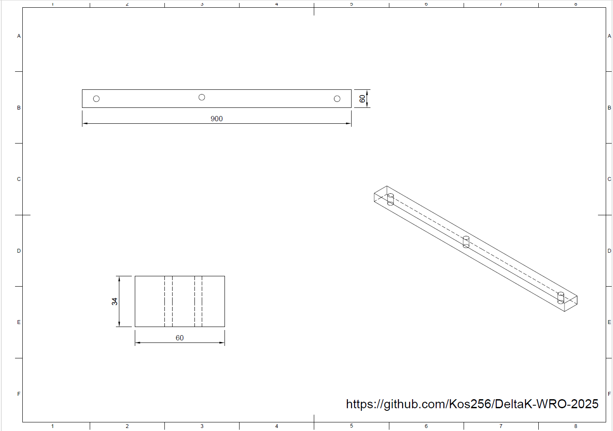
</p>
**Key Components:**
- **SG90 9g Micro Servo Motor**
  - Torque: 1.8 kg·cm (4.8V)
  - Speed: 0.1 sec/60° (4.8V)
  - Rotation: 180° (sufficient for full left/right steering)
  - Weight: 9g (minimal impact on front-end weight distribution)

- **3D Printed Linkages:** Connect the servo horn to both front wheel holders, ensuring synchronized steering
- **Wheel Holders:** Custom-designed to allow smooth rotation while maintaining structural rigidity

### Steering Geometry

The parallel linkage geometry provides:
- **Turning Radius:** Approximately [X] cm (suitable for WRO track dimensions)
- **Steering Angle:** ±[X]° from center
- **Response Time:** <100ms from command to full deflection

While not true Ackermann steering (which would provide optimal tire scrub reduction), our testing showed that for Delta Bot's weight and speed, the parallel linkage performs adequately without significant tire wear or turning inefficiency.

<!-- ⚠️⚠️⚠️ REMINDER: ADD 3D BLUEPRINTS OF STEERING LINKAGES AND WHEEL HOLDERS ⚠️⚠️⚠️ -->

**Potential Improvements:**
- Implement Ackermann geometry for competition at higher speeds
- Use ball-bearing joints instead of printed pivots to reduce friction
- Upgrade to a digital servo for finer angle control

---

## Drivetrain <a class="anchor" id="drivetrain"></a>

<!-- ⚠️⚠️⚠️ REMINDER: ADD DRIVETRAIN ASSEMBLY PHOTOS ⚠️⚠️⚠️ -->

### Rear Axle Configuration

The rear axle is the mechanical heart of Delta Bot, directly connecting both rear wheels through the custom motor assembly.

**Axle Design:**
- **Material:** 3D Printed in PLA
- **Diameter:** [Specify diameter in mm]
- **Length:** Spans the full width of the chassis, passing through the motor housing
- **Bearings:** 3D printed bearing holders on each side maintain axle alignment

**Power Transmission:**
1. Motor shaft directly drives the central axle
2. Axle rotates both rear wheels simultaneously (locked differential effect)
3. Encoder tracks axle rotation for precise odometry

### Motor Control

The custom motor is controlled via the **XRP Controller Board**, which features:
- H-bridge motor driver for bidirectional control
- PWM speed control (0-100% duty cycle)
- Current sensing for stall detection
- Integration with Raspberry Pi 5 via serial communication

<!-- ⚠️⚠️⚠️ REMINDER: ADD 3D BLUEPRINTS OF AXLE HOLDERS AND BEARING MOUNTS ⚠️⚠️⚠️ -->

---

## Chassis <a class="anchor" id="chassis"></a>

<!-- ⚠️⚠️⚠️ REMINDER: ADD CHASSIS PHOTOS (top view, bottom view, exploded view if available) ⚠️⚠️⚠️ -->
<p align="center">
  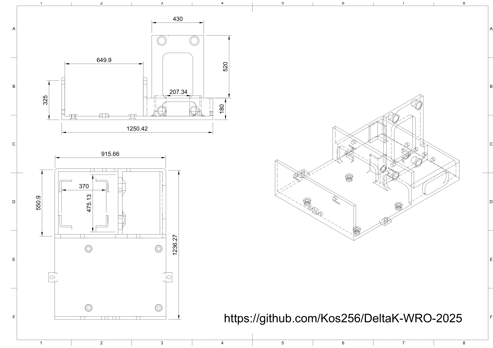
</p>

### Design Evolution

Delta Bot's chassis underwent four major iterations before reaching its final form. Our design priorities were:
1. **Lightweight construction** to maximize speed and battery life
2. **Sensor accessibility** for easy debugging and adjustment
3. **Modular design** allowing component swaps without full disassembly
4. **Structural rigidity** to prevent flex during high-speed turns

### 3D Printed Architecture

The chassis consists of **30+ custom 3D printed PLA+ components**, including:

**Main Structural Components:**
- Base chassis plate (main structural member)
- Motor mounting brackets (secure custom motor)
- Front axle holders (support steering mechanism)
- Rear axle bearing holders (maintain alignment)

**Sensor Mounting:**
- RPLidar mounting tower (elevated for 360° visibility)
- PiCam2 mount (angled for optimal field of view)
- Ultrasonic sensor brackets (front-facing backup sensor)
- IMU mounting plate (vibration-isolated for accurate readings)

**Electronics Housing:**
- Raspberry Pi 5 mounting tray
- XRP board mounting brackets
- Battery compartment (secures three LiPo batteries)
- Voltage regulator housing

**Cable Management:**
- Wire routing channels integrated into chassis
- Snap-fit cable clips
- Modular connector access ports

### 3D Printing Specifications

- **Printer:** Creality K1C
- **Material:** PLA+ filament (higher strength than standard PLA)
- **Filament Dryer:** Creality Filament Dryer (prevents moisture absorption for consistent prints)
- **Layer Height:** 0.2mm (balance between strength and print time)
- **Infill:** 20% (sufficient strength without excessive weight)
- **Print Time:** Approximately [X] hours total for all components

<!-- ⚠️⚠️⚠️ REMINDER: ADD ALL 3D MODEL BLUEPRINTS/STL FILES IN ./3d-models/ FOLDER ⚠️⚠️⚠️ -->
<!-- Include: Chassis base, motor mounts, sensor mounts, axle holders, electronics trays, cable management clips -->

**Design Files:**
All 3D models are available in the `./3d-models/` directory in STL format, ready for printing.

---

## Wheels <a class="anchor" id="wheels"></a>

<!-- ⚠️⚠️⚠️ REMINDER: ADD WHEEL PHOTOS AND TREAD PATTERN CLOSE-UPS ⚠️⚠️⚠️ -->
<p align="center">
  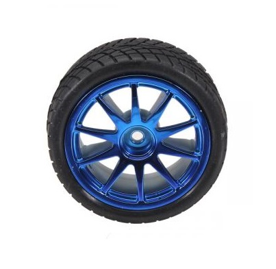
</p>

**Specifications:**
- **Type:** 65mm Circular Tracked Treaded Wheels
- **Diameter:** 65mm
- **Tread Pattern:** Deep treads for maximum grip on competition mat
- **Material:** Rubber compound
- **Configuration:** 4-wheel drive (2 powered rear wheels, 2 steered front wheels)

**Performance Characteristics:**
- **Grip:** Excellent traction on the foam mat surface used in WRO competitions
- **Rolling Resistance:** Low enough for efficient battery use
- **Durability:** Treaded design resists wear during testing and competition

The 65mm diameter was chosen to balance:
- **Speed:** Larger diameter = higher top speed at same RPM
- **Torque:** Not so large that motor torque becomes insufficient for acceleration
- **Ground Clearance:** Adequate clearance to avoid scraping on uneven mat sections

---

# Power and Sense Management <a class="anchor" id="power-and-sense-management"></a>

Delta Bot's sensor suite represents a comprehensive approach to environmental awareness, combining vision, mapping, inertial measurement, and proximity sensing for robust autonomous navigation.

## Raspberry Pi 5 <a class="anchor" id="raspberry-pi-5"></a>

<!-- ⚠️⚠️⚠️ REMINDER: ADD RASPBERRY PI 5 INSTALLATION PHOTO ⚠️⚠️⚠️ -->
<p align="center">
  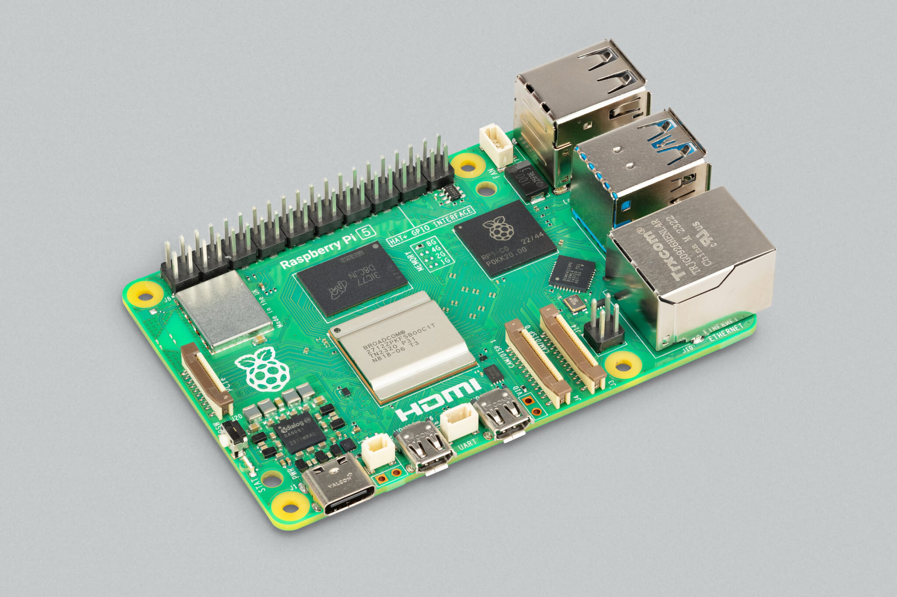
</p>


### Raspberry Pi 5 Pinout <a class="anchor" id="raspberry-pi-5"></a>

<p align="center">
  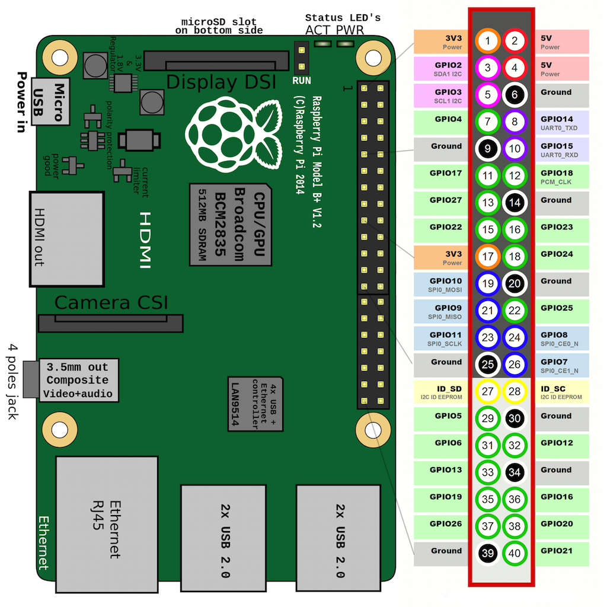
</p>

The **Raspberry Pi 5** serves as Delta Bot's main brain, handling all high-level processing tasks.

**Technical Specifications:**
- **Processor:** Broadcom BCM2712 (Quad-core Cortex-A76 @ 2.4GHz)
- **RAM:** 8GB LPDDR4X
- **Storage:** 256GB NVMe SSD (via PCIe interface) - Cost: 46 CAD
- **GPIO:** 40-pin header for sensor and actuator connections
- **USB:** USB 3.0 ports for camera and LiDAR connectivity
- **Power:** 5V/5A via USB-C (delivered through voltage regulation system)

**Why Raspberry Pi 5?**

After struggling with Arduino Uno (insufficient processing power and poor camera support) and Raspberry Pi 4 (overwhelmed by LiDAR data), the Pi 5 was essential:

1. **Massive Processing Power:** The 2.4GHz quad-core processor handles:
   - Real-time LiDAR data processing (thousands of distance measurements per second)
   - Computer vision algorithms (OpenCV) for color detection and object recognition
   - Sensor fusion algorithms combining IMU, encoder, ultrasonic, and vision data
   - Path planning and navigation decision-making
   
2. **Camera Support:** Native support for PiCam2 with no communication issues

3. **Multi-threading:** Runs separate processes for sensor data acquisition, vision processing, and motor control without lag

4. **NVMe Storage:** Fast SSD storage allows quick boot times and efficient data logging

**Cost:** 140 CAD

---

## XRP Controller Board <a class="anchor" id="xrp-board"></a>

<!-- ⚠️⚠️⚠️ REMINDER: ADD XRP BOARD PHOTO AND CONNECTION DIAGRAM ⚠️⚠️⚠️ -->
<p align="center">
  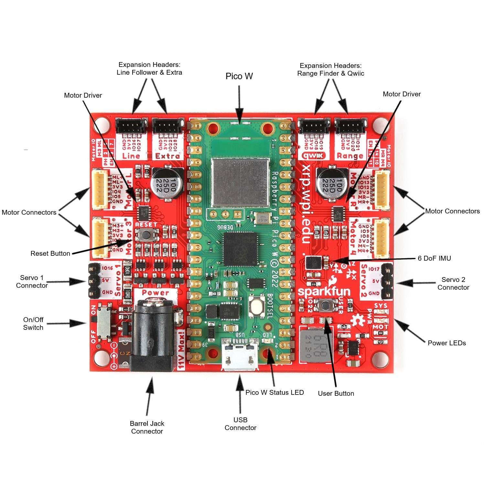
</p>

The **XRP (Experiential Robotics Platform) Controller Board** serves as the motor control and sensor interface subsystem.

**Key Features:**
- **Built-in Raspberry Pi Pico (RP2040):** Dedicated microcontroller for real-time motor control
- **Integrated LSM6DSOX IMU:** 6-axis gyroscope and accelerometer (included with board)
- **H-Bridge Motor Drivers:** Direct motor control without external drivers
- **Servo Control Pins:** Native support for servo motors
- **Encoder Inputs:** Dedicated pins for quadrature encoder reading
- **GPIO Expansion:** Additional pins for ultrasonic and other sensors

**Communication with Raspberry Pi 5:**
The XRP board communicates with the Raspberry Pi 5 via **serial UART** connection, allowing:
- High-level navigation commands from Pi 5
- Low-level motor control execution on XRP
- Real-time IMU data streaming to Pi 5
- Encoder position feedback for odometry

**Cost:** 60 CAD (includes LSM6DSOX IMU)

---

## Vision System - PiCam2 <a class="anchor" id="picam2"></a>

<!-- ⚠️⚠️⚠️ REMINDER: ADD CAMERA MOUNTING PHOTO AND FIELD OF VIEW DIAGRAM ⚠️⚠️⚠️ -->
<p align="center">
  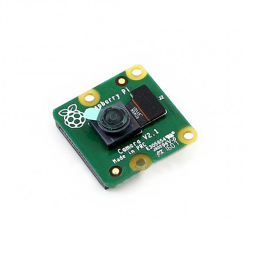   
</p>

  
### Camera Mount Drawing


<p align="center">
  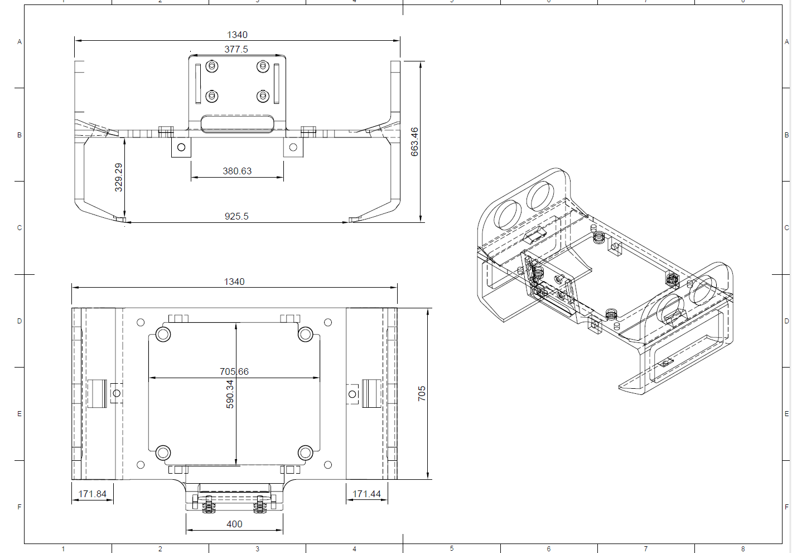
</p>

**Specifications:**
- **Sensor:** Sony IMX219 (8-megapixel sensor)
- **Resolution:** 3280 × 2464 pixels (still), 1920 × 1080 @ 30fps (video)
- **Field of View:** 62.2° × 48.8°
- **Interface:** CSI (Camera Serial Interface) direct to Raspberry Pi 5
- **Focus:** Fixed focus optimized for 1-2 meter range

**Mounting Position:**
The camera is mounted at the front of the chassis, angled slightly downward (approximately 15-20°) to capture:
- **Turn lines** (orange and blue) on the track surface
- **Traffic signs** (red and green pillars) at 1-2 meters distance
- **Parking walls** (magenta markers)

**Vision Processing:**
The Pi 5 runs **OpenCV** (Python) for real-time image processing:
- **Color detection** using HSV color space (more robust than RGB under varying lighting)
- **Bounding box creation** around detected objects (obstacles, parking walls)
- **Centroid calculation** for determining object position and distance
- **Real-time frame processing** at 30 fps for responsive obstacle avoidance

**Cost:** 33 CAD

---

## RPLidar A2M12 <a class="anchor" id="rplidar"></a>

<!-- ⚠️⚠️⚠️ REMINDER: ADD RPLIDAR MOUNTING PHOTO AND SCANNING VISUALIZATION ⚠️⚠️⚠️ -->
<p align="center">
  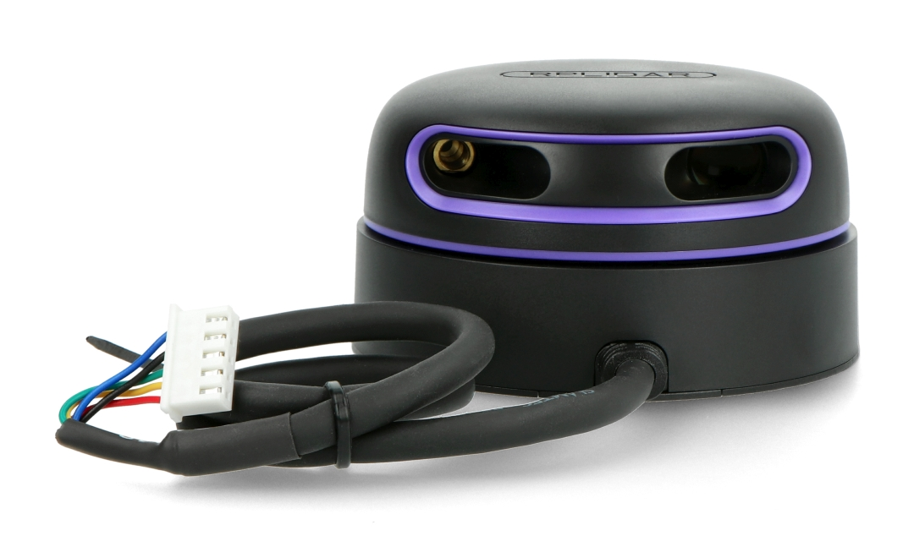
</p>

### Lidar Mount Drawing

<p align="center">
  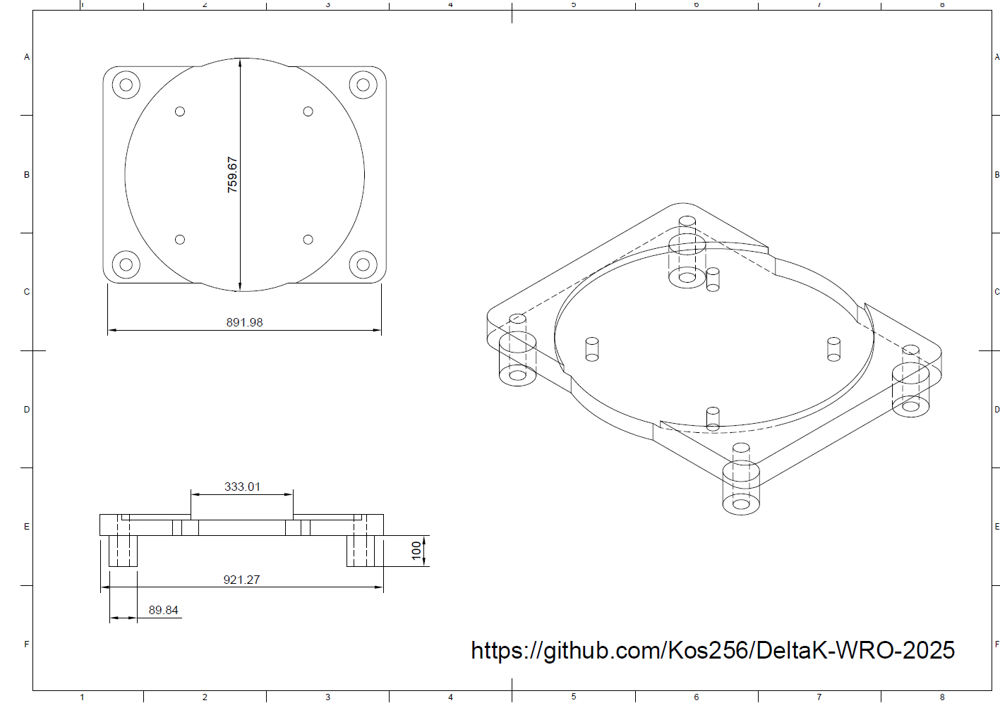
</p>

The **RPLidar A2M12** is Delta Bot's primary navigation sensor, providing 360-degree environmental mapping.

**Technical Specifications:**
- **Range:** 0.15m - 12m
- **Scan Rate:** 5.5Hz - 10Hz (adjustable)
- **Angular Resolution:** 0.9° (400 samples per 360° scan)
- **Sample Rate:** 4000 samples/second
- **Interface:** USB connection to Raspberry Pi 5
- **Power:** 5V/2A
- **Weight:** ~190g (including motor and mounting bracket)

**Mounting Position:**
The LiDAR is mounted on an elevated tower at the center of the robot to ensure:
- **Unobstructed 360° view** (no chassis components block the laser)
- **Correct height** to detect obstacles and walls without floor interference
- **Stability** during high-speed maneuvers (no vibration-induced noise)

**Role in Navigation Strategy:**

1. **Wall Mapping:** Creates a real-time 2D map of the track walls, allowing the robot to understand the track boundaries

2. **Path Planning:** Identifies available space for navigation:
   - Detects gaps in walls for turn detection
   - Calculates safe distances from obstacles
   - Determines parking space location and dimensions

3. **Collision Prevention:** Continuously monitors all directions, preventing collisions with:
   - Track walls
   - Traffic sign obstacles
   - Other unexpected objects

4. **Distance Measurement:** Provides precise distance readings in all directions, used for:
   - Maintaining safe distance from walls during straight-line navigation
   - Measuring distance to obstacles before avoidance maneuvers
   - Confirming parking space dimensions

**Data Processing:**
The LiDAR generates approximately **4000 distance measurements per second**. The Raspberry Pi 5 processes this data stream to:
- Filter noise and outliers
- Build occupancy grid maps
- Identify clusters (walls, obstacles)
- Calculate free space for path planning

**Why LiDAR was Essential:**
Our early ultrasonic-only approach failed because:
- Ultrasonic sensors have narrow fields of view (~15°)
- Multiple ultrasonics cause interference
- Cannot create comprehensive maps

The LiDAR provides complete environmental awareness that ultrasonics simply cannot match.

**Cost:** 210 CAD

---

## LSM6DSOX IMU <a class="anchor" id="imu-sensor"></a>

<!-- ⚠️⚠️⚠️ REMINDER: ADD IMU MOUNTING PHOTO ⚠️⚠️⚠️ -->
<p align="center">
  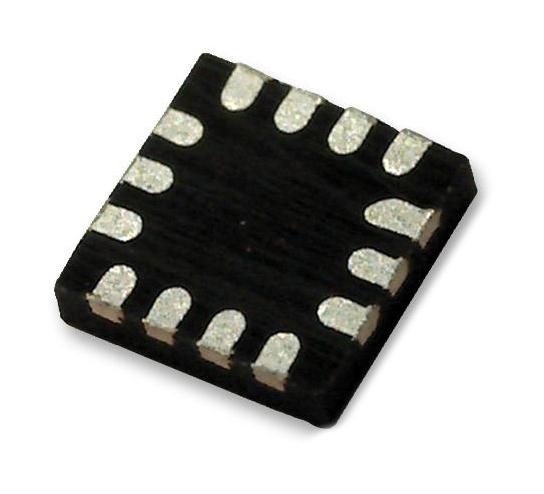
</p>

**Technical Specifications:**
- **Chip:** STMicroelectronics LSM6DSOX
- **Gyroscope Range:** ±125/±250/±500/±1000/±2000 dps (degrees per second)
- **Accelerometer Range:** ±2/±4/±8/±16 g
- **Interface:** I2C (integrated into XRP board)
- **Update Rate:** Up to 6.66 kHz (configurable)
- **Precision:** 16-bit ADC resolution

**Integrated with XRP Board:**
The LSM6DSOX comes pre-soldered and integrated with the XRP Controller Board, eliminating the need for separate wiring and mounting.

**Role in Navigation:**

The IMU is critical for **precise turning and orientation tracking**:

1. **Gyroscope (Primary Use):** Measures angular velocity (rotation rate) around the Z-axis (vertical axis of the robot). By integrating angular velocity over time, we calculate the robot's current heading angle.

2. **Turn Angle Calculation:** 
   - Robot starts at 0° heading
   - IMU integrates gyroscope data to track cumulative angle change
   - When turning 90° at corners, IMU ensures exact 90° rotation (not 87° or 93°)
   - Critical for maintaining orientation after multiple turns

3. **Drift Compensation:** 
   - All IMUs experience drift (small errors accumulate over time)
   - We calibrate drift during initialization
   - Periodic corrections using LiDAR wall alignment prevent long-term drift

4. **Accelerometer (Secondary Use):**
   - Detects sudden impacts or collisions
   - Monitors robot tilt (ensures robot is level)
   - Validates motion (confirms robot is actually moving when motors are commanded)

**Why IMU was Essential:**
Early attempts using only encoder-based dead reckoning for turns resulted in:
- Cumulative angle errors (small steering imperfections compound)
- Wheel slip causing angle miscalculations
- Inability to recover from collisions or unexpected pushes

The IMU provides **absolute angular velocity measurement** independent of wheel motion, ensuring turns are always precise.

**Cost:** Included with XRP Board (60 CAD total)

---

## HC-SR04 Ultrasonic Sensor <a class="anchor" id="ultrasonic"></a>

<!-- ⚠️⚠️⚠️ REMINDER: ADD ULTRASONIC SENSOR MOUNTING PHOTO ⚠️⚠️⚠️ -->
<p align="center">
  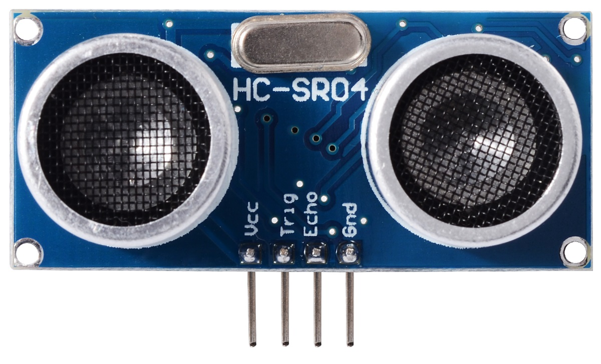
</p>

**Technical Specifications:**
- **Operating Voltage:** 5V
- **Range:** 2cm - 400cm
- **Accuracy:** ±3mm
- **Measuring Angle:** 15° cone
- **Trigger Pulse:** 10µs
- **Echo Pulse:** Proportional to distance

**Mounting Position:**
Front-facing, centered on the chassis

**Role in System:**
The ultrasonic sensor serves as a **backup/redundancy sensor** to the LiDAR:

1. **Front Obstacle Detection:** Quickly detects objects directly in front
2. **LiDAR Validation:** Cross-checks LiDAR readings for critical front obstacles
3. **Close-Range Safety:** Ultrasonic performs better than LiDAR at very close range (<15cm)
4. **Emergency Stop:** Can trigger emergency braking if front obstacle is too close

**Why Backup Sensor?**
During nationals, when our ultrasonic wiring short-circuited, the robot could still function using LiDAR alone. However, the ultrasonic provides:
- Faster response time for front obstacles (simpler processing than LiDAR)
- Redundancy in case of LiDAR failure
- Confidence in front-facing decisions

**Cost:** 14 CAD

---

## Motor Encoder <a class="anchor" id="motor-encoder"></a>

<!-- ⚠️⚠️⚠️ REMINDER: ADD ENCODER INTEGRATION PHOTO ⚠️⚠️⚠️ -->

**Specifications:**
- **Type:** DG01D-E Quadrature Encoder
- **Resolution:** [Specify pulses per revolution]
- **Output:** Two-channel quadrature signal (A and B phases)
- **Interface:** Connected to XRP board encoder inputs

**Integration:**
The encoder is integrated directly into our custom motor assembly (see [Custom Motor Design](#custom-motor-design)), providing precise feedback on wheel rotation.

**Role in Odometry:**

1. **Distance Measurement:** By counting encoder pulses and knowing wheel diameter, we calculate exact distance traveled:
   ```
   Distance = (Encoder Pulses / Pulses per Revolution) × Wheel Circumference
   ```

2. **Speed Control:** Real-time encoder feedback enables closed-loop speed control:
   - Measure actual wheel speed
   - Compare to target speed
   - Adjust motor PWM to maintain consistent speed

3. **Position Tracking:** Combined with IMU heading, encoder distance enables dead reckoning:
   - Track X, Y position on the field
   - Validate LiDAR-based localization
   - Detect wheel slip (encoder shows no movement despite motor running)

4. **Calibration:** Encoder data helps calibrate:
   - Wheel diameter variations
   - Motor performance curves
   - Acceleration/deceleration profiles

**Encoder Processing:**
The XRP board's RP2040 microcontroller handles encoder counting in hardware, preventing missed pulses even during intensive processing tasks.

**Cost:** 23 CAD (including motor modifications)

---

## Power System <a class="anchor" id="power-system"></a>

<!-- ⚠️⚠️⚠️ REMINDER: ADD POWER SYSTEM DIAGRAM AND BATTERY PLACEMENT PHOTOS ⚠️⚠️⚠️ -->
<p align="center">
  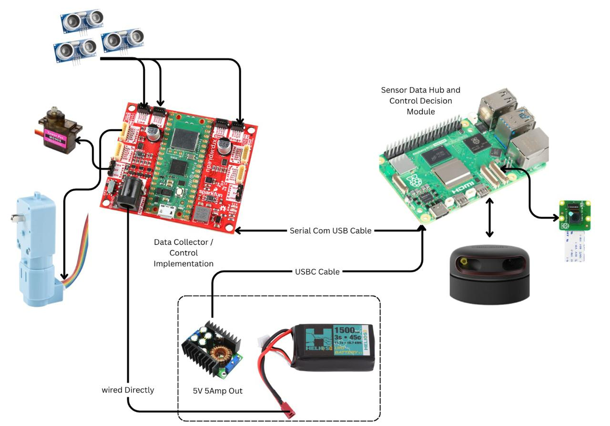
</p>

Delta Bot's power system is designed for **high capacity, voltage flexibility, and safety**.

### Battery Configuration

**3× 1500mAh LiPo Batteries**
- **Voltage:** 7.4V (2S configuration) per battery
- **Capacity:** 1500mAh per battery = 4500mAh total
- **Discharge Rate:** 25C (sufficient for motor current spikes)
- **Configuration:** Can be wired in parallel (7.4V, 4500mAh) or series (22.2V, 1500mAh) depending on power requirements
- **Weight:** ~120g total
- **Cost:** 18 CAD × 3 = 54 CAD

<!-- ⚠️⚠️⚠️ REMINDER: ADD BATTERY RUNTIME TEST DATA ⚠️⚠️⚠️ -->

**Battery Life:**
- Estimated runtime: [X] minutes of continuous operation
- Competition run duration: ~3-5 minutes (well within capacity)
- Safety margin: Batteries are never depleted below 20% to preserve lifespan

### Voltage Regulation

Different components require different voltages, necessitating a multi-stage voltage regulation system:

**Voltage Regulator System (Cost: 50 CAD)**

1. **7.4V → 5V Step-Down Regulator:**
   - Powers: Raspberry Pi 5 (5V/5A requirement)
   - Type: High-efficiency buck converter
   - Current Capacity: 5A continuous

2. **7.4V → 5V Step-Down Regulator (Secondary):**
   - Powers: RPLidar A2M12 (5V/2A requirement)
   - Separate regulator prevents LiDAR current spikes from affecting Pi 5

3. **7.4V Direct:**
   - Powers: XRP board (accepts 7.4V input directly)
   - XRP board has onboard regulators for its components

4. **7.4V → [Motor Voltage] Regulator:**
   - Powers: Custom drive motor
   - May include step-up converter if higher voltage needed

<!-- ⚠️⚠️⚠️ REMINDER: ADD DETAILED POWER DISTRIBUTION DIAGRAM ⚠️⚠️⚠️ -->

### Power Distribution

**Pi HAT (Cost: 30 CAD):**
A custom power distribution board (Pi HAT) mounts directly on the Raspberry Pi 5's GPIO header, providing:
- Clean 5V power delivery to Pi 5
- Fused protection circuits
- Power switching (on/off control)
- LED status indicators

### Safety Features

1. **Fused Connections:** Each major component has inline fuses to prevent damage from short circuits
2. **Low-Voltage Cutoff:** Software monitors battery voltage and prevents over-discharge
3. **Current Monitoring:** Detect abnormal current draw (stalled motor, short circuits)
4. **Emergency Stop:** Physical button to immediately cut all power


---

# Software Architecture <a class="anchor" id="software-architecture"></a>

Delta Bot's software is designed as a modular, multi-threaded system where each subsystem operates independently while sharing data through a central coordination layer.

## Code Structure <a class="anchor" id="code-structure"></a>

<!-- ⚠️⚠️⚠️ REMINDER: ADD SOFTWARE ARCHITECTURE DIAGRAM ⚠️⚠️⚠️ -->

### File Organization

```
delta-bot/
│
├── main.py                  # Main control loop and state machine
├── config.py                # Configuration parameters and constants
│
├── sensors/
│   ├── lidar.py            # RPLidar data acquisition and processing
│   ├── camera.py           # PiCam2 image capture and preprocessing
│   ├── imu.py              # IMU data reading and fusion
│   ├── ultrasonic.py       # Ultrasonic distance measurement
│   └── encoder.py          # Motor encoder position tracking
│
├── vision/
│   ├── color_detection.py  # HSV-based color threshold detection
│   ├── obstacle_detection.py  # Red/green traffic sign detection
│   ├── parking_detection.py   # Magenta parking wall detection
│   └── line_detection.py      # Orange/blue turn line detection
│
├── navigation/
│   ├── mapping.py          # LiDAR-based map building
│   ├── path_planning.py    # Route calculation and obstacle avoidance
│   ├── localization.py     # Position estimation using sensor fusion
│   └── turn_control.py     # Precise turning using IMU
│
├── control/
│   ├── motor_control.py    # Motor speed and direction control
│   ├── servo_control.py    # Steering angle control
│   └── pid_controller.py   # PID implementation for stable control
│
├── communication/
│   └── xrp_interface.py    # Serial UART communication with XRP board
│
└── utils/
    ├── data_logger.py      # Performance data logging
    └── helpers.py          # Utility functions
```

### Programming Languages

- **Python 3.11:** All Raspberry Pi 5 code (sensor processing, vision, navigation, high-level control)
- **MicroPython:** XRP board code (motor drivers, servo control, encoder reading, IMU interfacing)

### Libraries Used

**Raspberry Pi 5 (Python):**
- **OpenCV (cv2):** Computer vision and image processing
- **rpicam2:** Raspberry Pi camera interface
- **NumPy:** Numerical computations and array operations
- **Pillow (PIL):** Image manipulation
- **regex (re):** Pattern matching and data parsing
- **serial (PySerial):** UART communication with XRP board
- **rplidar:** LiDAR data acquisition library

**XRP Board (MicroPython):**
- **XRPLib:** Official XRP board library for motor control, servo control, and sensor interfaces
- **machine:** Low-level hardware control (UART, I2C, PWM)

---

## Computer Vision <a class="anchor" id="computer-vision"></a>

<!-- ⚠️⚠️⚠️ REMINDER: ADD COMPUTER VISION PROCESSING PIPELINE DIAGRAM ⚠️⚠️⚠️ -->

Delta Bot's vision system uses **HSV color space** instead of RGB for robust color detection under varying lighting conditions.

### Color Detection Pipeline

1. **Image Capture:** PiCam2 captures 1920×1080 frames at 30fps

2. **Color Space Conversion:** Convert BGR (OpenCV default) → HSV
   - **Hue:** Color type (0-180° in OpenCV)
   - **Saturation:** Color intensity (0-255)
   - **Value:** Brightness (0-255)

3. **Color Thresholding:** Define HSV ranges for each color:

<!-- ⚠️⚠️⚠️ REMINDER: ADD YOUR ACTUAL HSV THRESHOLD VALUES HERE ⚠️⚠️⚠️ -->

```python
# Example HSV thresholds (adjust based on testing)
RED_LOWER = np.array([0, 120, 70])
RED_UPPER = np.array([10, 255, 255])

GREEN_LOWER = np.array([40, 50, 50])
GREEN_UPPER = np.array([80, 255, 255])

ORANGE_LOWER = np.array([10, 100, 100])
ORANGE_UPPER = np.array([25, 255, 255])

BLUE_LOWER = np.array([100, 150, 0])
BLUE_UPPER = np.array([130, 255, 255])

MAGENTA_LOWER = np.array([140, 50, 50])
MAGENTA_UPPER = np.array([170, 255, 255])
```

4. **Morphological Operations:** Clean up noise
   - Erosion: Remove small false positives
   - Dilation: Fill gaps in detected regions

5. **Contour Detection:** Find connected regions of detected colors

6. **Bounding Box Creation:** Draw rectangles around detected objects

7. **Centroid Calculation:** Find center point (x, y) of each bounding box

8. **Object Classification:** Determine object type based on:
   - Color (red/green obstacle, orange/blue line, magenta parking)
   - Size (filter out small noise)
   - Shape (aspect ratio)
   - Position in frame

### Frame Processing Rate

- **Target:** 30 fps (real-time)
- **Actual:** Achieved on Raspberry Pi 5 (unlike Pi 4 which struggled)
- **Latency:** <50ms from capture to decision

---

## Sensor Fusion <a class="anchor" id="sensor-fusion"></a>

<!-- ⚠️⚠️⚠️ REMINDER: ADD SENSOR FUSION DIAGRAM SHOWING HOW DATA COMBINES ⚠️⚠️⚠️ -->

Delta Bot combines data from five sensors to build a comprehensive understanding of its environment:

### Multi-Sensor Integration

1. **LiDAR (Primary Mapping):**
   - Builds 2D occupancy grid of environment
   - Detects walls, obstacles, and free space
   - Provides 360° awareness

2. **Camera (Object Recognition):**
   - Identifies traffic sign colors (red/green)
   - Detects turn lines (orange/blue)
   - Locates parking walls (magenta)

3. **IMU (Orientation):**
   - Tracks robot heading (angle)
   - Measures angular velocity during turns
   - Detects unexpected rotations

4. **Encoder (Odometry):**
   - Measures distance traveled
   - Calculates speed
   - Detects wheel slip

5. **Ultrasonic (Backup):**
   - Validates front obstacle detection
   - Close-range safety checks

### Complementary Strengths

Each sensor compensates for others' weaknesses:
- **LiDAR provides spatial awareness** but can't identify colors → Camera adds color recognition
- **Camera identifies objects** but can't measure precise distances → LiDAR provides exact measurements
- **Encoder tracks distance** but accumulates error over time → LiDAR corrects position drift
- **IMU tracks heading** but drifts over time → LiDAR wall alignment corrects drift

---

## Communication Protocol <a class="anchor" id="communication"></a>

### Raspberry Pi 5 ↔ XRP Board (UART Serial)

<!--
- **Pi 5 TX** (GPIO 14) → **XRP RX**
- **Pi 5 RX** (GPIO 15) → **XRP TX**
-->
The XRP board is connected to one of the USB 3.0 ports on the Pi 5 via a micro-usb cable. This is the main serial connection between the hardware controller and the main processor.
- **Baud Rate:** 230400
- **Protocol:** Plain text commands with basic formatting.

**Command Structure:**

**Pi 5 → XRP (Commands):**
```
motor: <speed> (Set motor speed from -100 to 100)
servo: <angle> (Send a servo angle from 0 to 180 which sets a steering angle from -45 to 45)

Example: "<motor: 80; servo: -1>"
Move forward at 80% speed and keep servo free/inactive
```

**XRP → Pi 5 (Responses):**
The responding input data is structured as followed:
```py
outputData = {
    'i': i,
    # 'dist': rangefinder.distance(),
    # 'accel': f"{imu.get_acc_x()}, {imu.get_acc_y()}, {imu.get_acc_z()}",
    # 'gyro': f"{imu.get_roll()}, {imu.get_heading()}, {imu.get_yaw()}",
    # 'gyrorate': f"{imu.get_gyro_x_rate()}, {imu.get_gyro_y_rate()}, {imu.get_gyro_z_rate()}"
    'accel': f"{imu.get_acc_x()}, {imu.get_acc_y()}",
    'gyroHeading': imu.get_heading(),
    # 'gyroHeadingRate': imu.get_gyro_y_rate()
    'distL': usLeft.distance(),
    'distR': usRight.distance()
}
```
A lot of desirable but unnecessary sensor values are commented out, just in case we need to send them.
```
accel: <x> <y>          (Provides the accelerometer's X and Y acceleration values)
ENCODER:<position>,<speed>
gyroHeading: <heading>  (Provides the heading of the robot reported by the onboard gyro sensor)
distL: <distance_cm>    (Reports left ultrasonic sensor's distance in centimeters)
distR: <distance_cm>    (Reports right ultrasonic sensor's distance in centimeters)
ACK:<command>       # Acknowledge command received
```

This conversation between the Pi 5 and XRP happen without thread blocking, which means sensor values can be fetched and motor instructions can be sent at any time.

**Error Handling:**
There isn't much error handling as there's not many factors of failure here, since the XRP's code is single threaded and stable. Here's what *is* checked:
- Ignore input if command's syntax is invalid.
- Automatic reconnection on communication failure

---

# Obstacle Management <a class="anchor" id="obstacle-management"></a>

Delta Bot's navigation strategy evolved through extensive testing to balance speed, accuracy, and robustness.

## Qualification Round Strategy <a class="anchor" id="quali-strategy"></a>

<!-- ⚠️⚠️⚠️ REMINDER: ADD QUALIFICATION ROUND STRATEGY DIAGRAM ⚠️⚠️⚠️ -->

**Objective:** Complete 3 laps as fast as possible, turning at orange or blue corner lines.

### Algorithm Overview

1. **Track Mapping Phase (First Lap):**
   - Use LiDAR to build a complete map of track boundaries
   - Identify wall positions and track dimensions
   - Calculate optimal racing line (path farthest from walls for maximum speed)

2. **Turn Detection:**
   - LiDAR detects gaps in walls (corners)
   - No reliance on color detection in qualification round
   - Turn trigger: LiDAR identifies corner geometry

3. **Turning Sequence:**
   - Approach corner at moderate speed
   - Slow down slightly before turn
   - Use IMU to execute precise 90° turn
   - Accelerate out of corner

4. **Straight-Line Navigation:**
   - Maintain center of track using LiDAR wall distance measurements
   - Simulated PID keeps robot straight using IMU heading
   - Encoder confirms distance traveled

5. **Lap Counting:**
   - Track number of 90° turns completed (12 turns = 3 laps)
   - After 12 turns, proceed to finish area

### Performance Metrics

- **Best Lap Time:** 14 seconds
- **Consistency:** [Add consistency data if available]
- **Reliability:** Successfully completes 3 laps in >X% of attempts

---

## Obstacle Round Strategy <a class="anchor" id="obstacle-strategy"></a>

<!-- ⚠️⚠️⚠️ REMINDER: ADD OBSTACLE AVOIDANCE STRATEGY DIAGRAM WITH EXAMPLES ⚠️⚠️⚠️ -->

**Objective:** Complete 3 laps while avoiding red and green traffic signs, with a mandatory U-turn if the last obstacle before lap 3 is red.

### Detection System

1. **Camera Continuously Scans** for red and green objects
2. **HSV Color Filtering** isolates potential obstacles
3. **Bounding Box Creation** around detected colors
4. **Centroid Calculation** determines obstacle center position
5. **Nearest Obstacle Selection:** Robot prioritizes closest detected obstacle

### Avoidance Decision Logic

```
IF red obstacle detected:
    Turn RIGHT to avoid
    
IF green obstacle detected:
    Turn LEFT to avoid
    
IF no obstacles detected:
    Continue straight using qualification round navigation
```

### Avoidance Execution

1. **LiDAR Validates Available Space:**
   - Check if right side (for red) or left side (for green) has sufficient clearance
   - Measure distance to walls in avoidance direction
   - Ensure no collision with track boundaries

2. **Calculate Avoidance Angle:**
   - Based on obstacle distance and position
   - Dynamically adjusted using camera centroid
   - Confirmed safe by LiDAR

3. **IMU-Controlled Avoidance Maneuver:**
   - Turn at calculated angle
   - Maintain angle while passing obstacle
   - Return to center line after clearing obstacle

4. **Encoder Confirms Distance:**
   - Track distance traveled during avoidance
   - Ensure full clearance before returning to center

### U-Turn Logic

**U-Turn Trigger Conditions:**
```
IF (lap_count == 2) AND (obstacles_remaining == 1) AND (last_obstacle == RED):
    Execute U-turn sequence
    Reverse direction for lap 3
```

**U-Turn Execution:**
1. Complete avoidance of final red obstacle
2. Move forward additional distance to clear obstacle zone
3. Execute 180° turn using IMU (precise angle critical)
4. Update internal direction variable (clockwise ↔ counterclockwise)
5. Continue lap 3 in opposite direction

**Challenge:** Accurately counting obstacles and identifying the "last" obstacle before lap 3 requires:
- Reliable obstacle detection (no false positives/negatives)
- Accurate lap counting (based on turn counting)
- Robust logic to handle edge cases (obstacles near corners)

### Performance Metrics

- **Obstacle Avoidance Success Rate:** [Add success percentage]
- **U-Turn Success Rate:** [Add success percentage]
- **Best Obstacle Round Score:** 10.0 (14 points)

---

## Parking Challenge <a class="anchor" id="parking-challenge"></a>

<!-- ⚠️⚠️⚠️ REMINDER: ADD PARKING CHALLENGE SEQUENCE DIAGRAMS ⚠️⚠️⚠️ -->

**Objective:** After completing obstacle rounds, locate and parallel park between magenta walls.

### Parking Detection

1. **Camera Scans for Magenta Color:**
   - Continuously search for magenta HSV threshold matches
   - Create bounding boxes around detected magenta regions

2. **LiDAR Detects Gap:**
   - Measure wall distances in all directions
   - Identify gap in walls (parking space opening)
   - Measure gap width to confirm sufficient space

3. **Cross-Validation:**
   - Both camera (magenta walls) AND LiDAR (gap) must confirm parking space
   - Reduces false positives (random magenta objects)

### Parking Sequence

**Phase 1: Positioning**
1. Drive parallel to parking space
2. Position robot so parking space is to the side
3. Stop when parking space is aligned with robot center

**Phase 2: Entry Turn**
1. Turn steering toward parking space (IMU-controlled angle)
2. Drive forward into parking space at slow speed
3. LiDAR monitors distance to back wall

**Phase 3: Alignment**
1. Straighten steering (servo to center position)
2. Continue forward until LiDAR detects appropriate distance from back wall
3. Stop precisely between front and back magenta walls

**Phase 4: Final Positioning**
1. Minor adjustments if needed (reverse slightly, straighten)
2. Confirm parallel alignment with walls using IMU
3. Complete stop - parking successful!

### Challenges Faced

<!-- ⚠️⚠️⚠️ REMINDER: ADD DETAILS ABOUT PARKING CHALLENGES AND WHY NOT SUCCESSFUL YET ⚠️⚠️⚠️ -->

**Current Status:** Parking challenge not yet successfully completed in competition.

**Primary Difficulties:**
- [Add specific challenges: magenta detection reliability, alignment precision, timing, etc.]
- [Explain what needs improvement]

**Planned Improvements:**
- [List specific improvements being developed]

---

# Code Implementation <a class="anchor" id="code-implementation"></a>

<!-- ⚠️⚠️⚠️ REMINDER: ADD ALL CODE SECTIONS BELOW WITH YOUR ACTUAL CODE ⚠️⚠️⚠️ -->
<!-- For each section, add the relevant Python/MicroPython code with detailed comments -->

## Main Control Loop <a class="anchor" id="main-loop"></a>

The main control loop implements a state machine to handle different phases of the competition.

```python
# ⚠️⚠️⚠️ ADD YOUR main.py CODE HERE ⚠️⚠️⚠️
# Include: State machine structure, main loop, state transitions

# Example structure (replace with your actual code):
"""
import time
from sensors import lidar, camera, imu
from navigation import path_planning, turn_control
from control import motor_control, servo_control

class RobotState:
    INIT = 0
    QUALIFICATION = 1
    OBSTACLE_AVOIDANCE = 2
    PARKING_SEARCH = 3
    PARKING = 4
    COMPLETE = 5

def main():
    # Initialize all systems
    state = RobotState.INIT
    
    while True:
        if state == RobotState.INIT:
            # Initialization code
            pass
            
        elif state == RobotState.QUALIFICATION:
            # Qualification round navigation
            pass
            
        elif state == RobotState.OBSTACLE_AVOIDANCE:
            # Obstacle detection and avoidance
            pass
            
        elif state == RobotState.PARKING_SEARCH:
            # Search for parking space
            pass
            
        elif state == RobotState.PARKING:
            # Execute parking maneuver
            pass
            
        elif state == RobotState.COMPLETE:
            # Stop all motors
            break

if __name__ == "__main__":
    main()
"""
```

---

## LiDAR Mapping <a class="anchor" id="lidar-code"></a>

LiDAR data processing creates a 2D occupancy grid map of the environment.

```python
# ⚠️⚠️⚠️ ADD YOUR sensors/lidar.py CODE HERE ⚠️⚠️⚠️
# Include: LiDAR initialization, data acquisition, map building, wall detection

# Example structure (replace with your actual code):
"""
from rplidar import RPLidar
import numpy as np

class LidarProcessor:
    def __init__(self, port='/dev/ttyUSB0'):
        self.lidar = RPLidar(port)
        self.scan_data = []
        
    def start_scanning(self):
        # Start LiDAR motor and scanning
        pass
        
    def get_scan(self):
        # Retrieve one complete 360° scan
        # Returns: list of (angle, distance) tuples
        pass
        
    def build_map(self, scans):
        # Convert scan data to occupancy grid
        pass
        
    def detect_walls(self, scan):
        # Identify wall segments from scan data
        pass
        
    def detect_gaps(self, scan):
        # Find gaps in walls (corners, parking space)
        pass
"""
```

---

## Color Detection <a class="anchor" id="color-detection-code"></a>

Camera-based color detection for obstacles, lines, and parking walls.

```python
# ⚠️⚠️⚠️ ADD YOUR vision/color_detection.py CODE HERE ⚠️⚠️⚠️
# Include: HSV thresholding, contour detection, bounding boxes, centroid calculation

# Example structure (replace with your actual code):
"""
import cv2
import numpy as np
from picamera2 import Picamera2

class ColorDetector:
    def __init__(self):
        self.camera = Picamera2()
        self.camera.configure(self.camera.create_preview_configuration())
        self.camera.start()
        
        # HSV thresholds for different colors
        self.RED_LOWER = np.array([0, 120, 70])
        self.RED_UPPER = np.array([10, 255, 255])
        # ... (add all color thresholds)
        
    def capture_frame(self):
        # Capture image from camera
        pass
        
    def detect_color(self, frame, lower_hsv, upper_hsv):
        # Detect specific color in frame
        # Returns: bounding boxes and centroids
        pass
        
    def detect_obstacles(self, frame):
        # Detect red and green traffic signs
        pass
        
    def detect_parking_walls(self, frame):
        # Detect magenta parking walls
        pass
        
    def detect_turn_lines(self, frame):
        # Detect orange and blue turn lines
        pass
"""
```

---

## IMU Integration <a class="anchor" id="imu-code"></a>

IMU data processing for precise heading tracking and turn execution.

```python
# ⚠️⚠️⚠️ ADD YOUR sensors/imu.py CODE HERE ⚠️⚠️⚠️
# Include: IMU initialization, gyroscope reading, angle integration, drift compensation

# Example structure (replace with your actual code):
"""
import time

class IMUProcessor:
    def __init__(self, xrp_interface):
        self.xrp = xrp_interface
        self.current_heading = 0.0
        self.last_update_time = time.time()
        
    def calibrate_drift(self):
        # Measure and compensate for gyroscope drift
        pass
        
    def update_heading(self):
        # Read angular velocity from IMU
        # Integrate to calculate current heading
        pass
        
    def get_heading(self):
        # Return current heading in degrees (0-360)
        return self.current_heading
        
    def turn_to_angle(self, target_angle):
        # Execute turn to reach target heading
        pass
        
    def reset_heading(self):
        # Reset heading to 0 (useful after calibration)
        self.current_heading = 0.0
"""
```

---

## Motor Control <a class="anchor" id="motor-control-code"></a>

Motor speed and direction control with encoder feedback.

```python
# ⚠️⚠️⚠️ ADD YOUR control/motor_control.py CODE HERE ⚠️⚠️⚠️
# Include: Motor commands, speed control, encoder reading, distance calculation

# Example structure (replace with your actual code):
"""
class MotorController:
    def __init__(self, xrp_interface):
        self.xrp = xrp_interface
        self.wheel_diameter = 65  # mm
        self.encoder_pulses_per_rev = 360  # adjust to your encoder
        
    def set_speed(self, speed):
        # Set motor speed (-100 to 100)
        # Negative = reverse, Positive = forward
        command = f"MOTOR:{speed}\n"
        self.xrp.send_command(command)
        
    def stop(self):
        # Stop motor
        self.set_speed(0)
        
    def get_encoder_position(self):
        # Request encoder position from XRP
        pass
        
    def get_distance_traveled(self):
        # Calculate distance from encoder pulses
        pass
        
    def drive_distance(self, distance_cm, speed):
        # Drive forward/backward a specific distance
        pass
"""
```

---

## Obstacle Avoidance <a class="anchor" id="obstacle-avoidance-code"></a>

Complete obstacle detection and avoidance implementation.

```python
# ⚠️⚠️⚠️ ADD YOUR navigation/obstacle_avoidance.py CODE HERE ⚠️⚠️⚠️
# Include: Obstacle detection logic, avoidance angle calculation, execution

# Example structure (replace with your actual code):
"""
class ObstacleAvoider:
    def __init__(self, camera, lidar, imu, motor, servo):
        self.camera = camera
        self.lidar = lidar
        self.imu = imu
        self.motor = motor
        self.servo = servo
        
        self.obstacle_count = 0
        self.lap_count = 0
        
    def detect_nearest_obstacle(self):
        # Use camera to find nearest red or green obstacle
        # Returns: (color, centroid, distance)
        pass
        
    def calculate_avoidance_angle(self, obstacle_color, obstacle_position):
        # Calculate steering angle to avoid obstacle
        # Red → turn right, Green → turn left
        pass
        
    def validate_clearance(self, direction):
        # Use LiDAR to ensure safe clearance in avoidance direction
        pass
        
    def execute_avoidance(self, obstacle_color):
        # Complete avoidance maneuver
        pass
        
    def check_uturn_condition(self):
        # Determine if U-turn is required
        if self.lap_count == 2 and self.last_obstacle_color == 'RED':
            return True
        return False
        
    def execute_uturn(self):
        # Perform 180° turn using IMU
        pass
"""
```

---

# Robot Construction Guide <a class="anchor" id="robot-construction-guide"></a>

This step-by-step guide will help you replicate Delta Bot from scratch.

## Prerequisites

**Tools Required:**
- 3D printer (we used Creality K1C)
- Soldering iron and solder
- Wire strippers
- Screwdrivers (Phillips and flathead)
- Hot glue gun (for temporary mounting/testing)
- Multimeter (for electrical testing)
- Computer with Arduino IDE and Python 3.11+

**Materials Required:**
- All components listed in [Cost Report](#cost-report)
- PLA+ filament (approximately 500g)
- Jumper wires (male-to-male, male-to-female, female-to-female)
- Heat shrink tubing
- Zip ties for cable management
- M3 screws and nuts (various lengths)

---

## Step 1: 3D Print All Components

**Printing Settings (Creality K1C):**
- **Material:** PLA+ and ABS
- **Layer Height:** 0.4mm + 0.6mm
- **Infill:** 20%
- **Print Speed:** 150mm/s
- **Supports:** Yes (for overhangs > 60°)
- **Brim:** Yes (for large flat parts to prevent warping)
---

## Step 2: Assemble Custom Motor

<!-- ⚠️⚠️⚠️ REMINDER: ADD DETAILED MOTOR ASSEMBLY PHOTOS FOR EACH STEP ⚠️⚠️⚠️ -->

1. **Disassemble TT Motor:**
   - Carefully open motor housing using small screwdriver
   - Remove internal components (keep organized!)
   - Note: Do not lose tiny gears or springs

2. **Prepare Encoder Integration:**
   - Position DG01D-E encoder on motor shaft
   - Ensure encoder disk aligns with optical sensors
   - Test encoder signals before permanent mounting

3. **Modify Motor Housing:**
   - Drill/file slots on both sides for axle pass-through
   - Ensure slots are aligned perfectly (use jig if possible)
   - Smooth all edges to prevent axle friction

4. **Reassemble Motor:**
   - Secure encoder with adhesive or screws
   - Carefully reassemble motor housing
   - Test motor rotation (should spin freely)

5. **Mount to Chassis:**
   - Position motor in custom motor mounts
   - Insert axle through both sides
   - Secure with M3 screws

**Testing:** Connect motor to XRP board and verify encoder readings before proceeding.

---

## Step 3: Assemble Steering System

<!-- ⚠️⚠️⚠️ REMINDER: ADD STEERING ASSEMBLY PHOTOS ⚠️⚠️⚠️ -->

1. **Attach Servo to Mount:**
   - Insert SG90 servo into `servo_mount.stl`
   - Secure with servo screws (usually included with servo)
   - Ensure servo rotates freely

2. **Install Front Axle Holders:**
   - Attach `front_axle_left.stl` and `front_axle_right.stl` to chassis
   - Insert smooth rod or axle pins for rotation

3. **Connect Steering Linkages:**
   - Attach `steering_linkage.stl` pieces to servo horn
   - Connect other ends to front axle holders
   - Adjust lengths for equal left/right steering

4. **Test Steering:**
   - Connect servo to XRP board
   - Test full range of motion (left, center, right)
   - Adjust linkages if needed

---

## Step 4: Install Wheels and Drivetrain

<!-- ⚠️⚠️⚠️ REMINDER: ADD WHEEL INSTALLATION PHOTOS ⚠️⚠️⚠️ -->

1. **Rear Wheels:**
   - Slide 65mm wheels onto rear axle (both sides of motor)
   - Secure with set screws or press-fit hubs
   - Ensure wheels are aligned and parallel

2. **Front Wheels:**
   - Attach 65mm wheels to front axle holders
   - Secure with appropriate fasteners
   - Test steering motion (wheels should turn together)

3. **Test Drive:**
   - Manually roll robot to check for friction
   - Wheels should roll smoothly without wobbling
   - Axles should not bind

---

## Step 5: Mount Electronics

<!-- ⚠️⚠️⚠️ REMINDER: ADD ELECTRONICS MOUNTING PHOTOS FOR EACH COMPONENT ⚠️⚠️⚠️ -->

### Raspberry Pi 5

1. Install NVMe SSD on bottom of Pi 5 (if using)
2. Mount Pi 5 to `pi5_mounting_tray.stl` using M2.5 screws
3. Attach Pi HAT for power distribution
4. Position tray on chassis (center, elevated for airflow)

### XRP Controller Board

1. Mount XRP board to `xrp_board_bracket.stl`
2. Position near motor for short motor wires
3. Secure with M3 screws

### RPLidar A2M12

1. Mount LiDAR to `lidar_mounting_plate.stl`
2. Attach plate to `lidar_tower.stl` (elevate LiDAR for clear view)
3. Secure tower to chassis center
4. Connect USB cable to Raspberry Pi 5

### PiCam2

1. Mount camera to `camera_mount.stl`
2. Angle mount ~15-20° downward
3. Position at front of chassis
4. Connect camera ribbon cable to Pi 5 CSI port

### HC-SR04 Ultrasonic Sensor

1. Insert sensor into `ultrasonic_bracket.stl`
2. Mount bracket at front of chassis (centered)
3. Wire to XRP board GPIO pins

### Batteries and Voltage Regulators

1. Place 3× LiPo batteries in `battery_compartment.stl`
2. Secure with velcro straps (allows easy removal)
3. Mount voltage regulators in `voltage_regulator_housing.stl`
4. Position regulators near batteries to minimize wire length

---

## Step 6: Wiring and Connections

<!-- ⚠️⚠️⚠️ REMINDER: ADD WIRING PHOTOS SHOWING ALL CONNECTIONS ⚠️⚠️⚠️ -->

**Power Distribution:**

1. **Battery to Voltage Regulators:**
   - Connect battery positive to main power switch
   - From switch, branch to all voltage regulators
   - Connect battery negative to common ground

2. **Voltage Regulator Outputs:**
   - 5V Regulator #1 → Raspberry Pi 5 (via Pi HAT)
   - 5V Regulator #2 → RPLidar A2M12
   - 7.4V Direct → XRP Board
   - 7.4V (or adjusted) → Motor driver on XRP

**Data Connections:**

3. **Raspberry Pi 5 Connections:**
   - PiCam2 → CSI camera port
   - RPLidar → USB 3.0 port
   - XRP Board → GPIO UART pins (TX/RX)

4. **XRP Board Connections:**
   - Custom Motor → Motor driver outputs
   - Motor Encoder → Encoder inputs (A, B channels)
   - SG90 Servo → Servo output pin
   - HC-SR04 Ultrasonic → GPIO (Trigger and Echo pins)
   - LSM6DSOX IMU → I2C (built into XRP board)

**Cable Management:**
- Route all wires through `wire_routing_channel.stl`
- Secure wires with `cable_clip.stl` pieces
- Use zip ties for additional security
- Leave some slack for maintenance access

---

## Step 7: Software Installation

### Raspberry Pi 5 Setup

1. **Install Raspberry Pi OS:**
   - Download Raspberry Pi OS (64-bit, desktop recommended)
   - Flash to NVMe SSD using Raspberry Pi Imager
   - Boot Pi 5 and complete initial setup

2. **Install Required Libraries:**
```bash
sudo apt update
sudo apt upgrade
sudo apt install python3-pip python3-opencv
pip3 install numpy pillow pyserial rplidar picamera2
```

3. **Clone Delta Bot Repository:**
```bash
git clone https://github.com/[your-username]/delta-bot-wro2025.git
cd delta-bot-wro2025
```

4. **Configure Permissions:**
```bash
# Add user to dialout group for serial access
sudo usermod -a -G dialout $USER

# Reboot for changes to take effect
sudo reboot
```

### XRP Board Setup

1. **Install XRPLib:**
   - Follow XRP official documentation for MicroPython setup
   - Connect XRP board via USB to computer
   - Upload MicroPython firmware

2. **Upload XRP Code:**
```bash
# Use Thonny IDE or similar to upload code
# Upload all files in /xrp_code/ directory
```

3. **Test XRP Functionality:**
   - Run motor test script
   - Verify servo response
   - Check IMU readings
   - Confirm encoder counting

---

## Step 8: Calibration and Testing

<!-- ⚠️⚠️⚠️ REMINDER: ADD CALIBRATION PROCEDURE PHOTOS/SCREENSHOTS ⚠️⚠️⚠️ -->

### IMU Calibration

1. Place robot on level surface
2. Run IMU calibration script
3. Let robot sit still for 30 seconds
4. Record drift compensation values

### Camera Calibration

1. Print color calibration targets (red, green, orange, blue, magenta)
2. Run color detection calibration script
3. Adjust HSV thresholds until colors detected reliably
4. Save calibration values to config file

### Motor Calibration

1. Measure exact wheel diameter
2. Count encoder pulses per revolution
3. Calculate distance per encoder pulse
4. Update configuration values

### Steering Calibration

1. Find servo center position (wheels straight)
2. Measure maximum left/right angles
3. Update servo angle limits in code

### LiDAR Calibration

1. Verify LiDAR mounting is level
2. Test 360° scanning for blind spots
3. Calibrate distance measurements against known distances

---

## Step 9: Initial Testing

<!-- ⚠️⚠️⚠️ REMINDER: ADD TESTING VIDEO OR PHOTOS ⚠️⚠️⚠️ -->

1. **Static Tests:**
   - Verify all sensors return data
   - Test motor forward/reverse
   - Test servo left/right
   - Check camera image capture

2. **Basic Movement:**
   - Drive forward 1 meter (measure accuracy)
   - Turn 90° using IMU (verify angle)
   - Test obstacle detection with colored objects

3. **Qualification Round Practice:**
   - Set up practice track
   - Run qualification algorithm
   - Measure lap times
   - Debug any issues

4. **Obstacle Round Practice:**
   - Add red/green traffic signs
   - Test obstacle detection and avoidance
   - Practice U-turn sequence
   - Refine avoidance angles

---

# Cost Report <a class="anchor" id="cost-report"></a>

Complete breakdown of all expenses for Delta Bot's development.

## Electronic Components

| Component | Quantity | Unit Cost (CAD) | Total (CAD) |
|-----------|----------|-----------------|-------------|
| Raspberry Pi 5 (8GB) | 1 | 140.00 | 140.00 |
| PiCam2 | 1 | 33.00 | 33.00 |
| RPLidar A2M12 | 1 | 210.00 | 210.00 |
| XRP Controller Board (with LSM6DSOX IMU) | 1 | 60.00 | 60.00 |
| Brushed DC Motor + encoder | 1 | 23.00 | 23.00 |
| SG90 9g Micro Servo | 1 | 2.00 | 2.00 |
| HC-SR04 Ultrasonic Sensor | 1 | 14.00 | 14.00 |
| LiPo Battery (1500mAh, 7.4V) | 3 | 18.00 | 54.00 |
| Voltage Regulators (Step-up/Step-down) | 1 set | 50.00 | 50.00 |
| Raspberry Pi HAT | 1 | 30.00 | 30.00 |
| NVMe SSD (256GB) | 1 | 46.00 | 46.00 |
| **Electronics Subtotal** | | | **662.00** |

## Mechanical Components

| Component | Quantity | Unit Cost (CAD) | Total (CAD) |
|-----------|----------|-----------------|-------------|
| 65mm Tracked Wheels | 4 | 8.00 | 32.00 |
| Steel Axle Rods (2mm-5mm diameter) | Various | 15.00 | 15.00 |
| Bearings and Bushings | Set | 10.00 | 10.00 |
| M3 Screws and Nuts (assorted) | 100+ | 12.00 | 12.00 |
| M2.5 Screws (for Pi mounting) | 20 | 5.00 | 5.00 |
| **Mechanical Subtotal** | | | **74.00** |

## 3D Printing Materials

| Item | Quantity | Unit Cost (CAD) | Total (CAD) |
|------|----------|-----------------|-------------|
| PLA+ Filament (1kg spools) | 1 kg | 35.00 | 35.00 |
| Prototyping Filament (iterations) | 2 kg | 30.00 | 60.00 |
| Filament Dryer (Creality) | 1 | 65.00 | 65.00 |
| **3D Printing Subtotal** | | | **160.00** |

## Wiring and Electrical

| Component | Quantity | Unit Cost (CAD) | Total (CAD) |
|-----------|----------|-----------------|-------------|
| Jumper Wires (M-M, M-F, F-F sets) | 3 sets | 10.00 | 30.00 |
| Heat Shrink Tubing (assorted) | 1 set | 8.00 | 8.00 |
| Solder and Flux | 1 | 15.00 | 15.00 |
| Zip Ties (cable management) | 100 pack | 5.00 | 5.00 |
| USB Cables (various lengths) | 3 | 8.00 | 24.00 |
| Power Switch | 1 | 6.00 | 6.00 |
| **Wiring Subtotal** | | | **88.00** |

## Parts Tested But Not Used

| Component | Reason Removed | Cost (CAD) |
|-----------|----------------|------------|
| Raspberry Pi 4 | Insufficient processing power | 120.00 |
| Arduino UNO | Poor camera support | 35.00 |
| PiCam v1.3 Wide Angle | Compatibility issues | 25.00 |
| L298N Motor Driver | Integrated into XRP board | 12.00 |
| 500 RPM DC Motor | Insufficient torque | 18.00 |
| LEGO Wheels | Insufficient grip | 20.00 |
| **Tested Parts Subtotal** | | **230.00** |

## Tools and Equipment

<!-- ⚠️⚠️⚠️ REMINDER: ADD ACTUAL TOOL COSTS IF YOU PURCHASED THEM ⚠️⚠️⚠️ -->

| Tool | Cost (CAD) |
|------|------------|
| Creality K1C 3D Printer | [Add cost if purchased] |
| Soldering Station | [Add cost if purchased] |
| Multimeter | [Add cost if purchased] |
| Wire Strippers | [Add cost if purchased] |
| Screwdriver Set | [Add cost if purchased] |
| Hot Glue Gun | [Add cost if purchased] |
| **Tools Subtotal** | **[Add total]** |

## Competition and Miscellaneous

| Item | Cost (CAD) |
|------|------------|
| Team Registration Fee | [Add if applicable] |
| Competition Mat (for practice) | [Add if purchased] |
| Traffic Sign Models (3D printed) | 15.00 |
| Shipping and Import Fees | ~50.00 |
| **Miscellaneous Subtotal** | **~65.00** |

---

## Total Cost Summary

| Category | Cost (CAD) |
|----------|------------|
| Electronic Components | 662.00 |
| Mechanical Components | 74.00 |
| 3D Printing Materials | 160.00 |
| Wiring and Electrical | 88.00 |
| Parts Tested (Not Used) | 230.00 |
| Tools and Equipment | [Add total] |
| Competition and Misc. | ~65.00 |
| **GRAND TOTAL** | **~1,279.00 + Tools** |

*Note: Costs are in Canadian Dollars (CAD). Prices may vary by region and retailer. Some tools may already be owned or borrowed, reducing total cost.*

---

# Future Improvements <a class="anchor" id="future-improvements"></a>

Based on six months of development and competition experience, we've identified several areas for enhancement:

## Hardware Improvements

1. **Ackermann Steering Geometry:**
   - Current parallel linkage causes minor tire scrub
   - Implementing true Ackermann would improve turning efficiency
   - Reduce tire wear during extended testing

2. **Brushless Motor Upgrade:**
   - More efficient than current brushed DC motor
   - Better thermal management for sustained performance
   - Longer lifespan and reduced maintenance

3. **Improved Camera Mount:**
   - Add adjustable tilt mechanism
   - Vibration dampening for sharper images
   - Wider field of view lens option

4. **Weight Distribution Optimization:**
   - Lower center of gravity for better handling
   - Balance weight more evenly front-to-back
   - Add adjustable ballast system

5. **Modular Sensor Mounting:**
   - Quick-release sensor mounts for rapid testing
   - Standardized mounting interfaces
   - Tool-free sensor angle adjustment

## Software Improvements

1. **Advanced Path Planning:**
   - Implement A* or RRT path planning algorithms
   - Dynamic re-routing when obstacles move
   - Predictive obstacle motion modeling

2. **Machine Learning Integration:**
   - Train neural network for robust obstacle detection
   - Adaptive color threshold learning
   - Automatic calibration using ML

3. **Sensor Fusion Enhancement:**
   - Kalman filter for combining sensor data
   - Better handling of conflicting sensor readings
   - Weighted sensor confidence based on conditions

4. **Parking Challenge Refinement:**
   - More precise alignment algorithms
   - Multi-point distance verification
   - Iterative positioning correction

5. **Code Optimization:**
   - Reduce processing latency
   - Parallel processing for sensor data
   - More efficient data structures

## Strategy Improvements

1. **Cleaner Turning:**
   - Smoother turn entry and exit
   - Speed optimization through corners
   - Minimal steering corrections post-turn

2. **Adaptive Speed Control:**
   - Variable speed based on track sections
   - Slow for obstacles, fast for straights
   - Smooth acceleration/deceleration curves

3. **Robust Error Recovery:**
   - Detect and recover from localization errors
   - Backup navigation strategies
   - Automatic reset and retry logic

4. **Multi-Strategy System:**
   - Different approaches for different track layouts
   - Automatic strategy selection based on conditions
   - A/B testing framework for strategies

---

# Acknowledgments <a class="anchor" id="acknowledgments"></a>

Team Delta K would like to express our gratitude to everyone who supported us throughout this journey:

**Haque Academy**
Thank you to our school for providing facilities, encouragement, and the opportunity to represent Pakistan at the international level. Your support for STEM education and robotics programs has been instrumental in our development.

**Coach Ali Saif**
Thank you for your guidance, patience, and technical expertise. Your mentorship helped us navigate challenges and pushed us to achieve more than we thought possible.

<!-- ⚠️⚠️⚠️ REMINDER: ADD ANY OTHER ACKNOWLEDGMENTS ⚠️⚠️⚠️ -->
<!-- Include: Family members, sponsors, mentors, community support, etc. -->

**[Add additional acknowledgments]:**
- Family members who supported late-night testing sessions
- Any sponsors or donors who provided financial support
- Community members who offered advice or resources
- Online communities (forums, Discord servers) that helped with technical issues

**World Robot Olympiad**
Thank you to WRO Pakistan and WRO International for organizing this incredible competition and providing a platform for young engineers to showcase their skills and learn from peers worldwide.

**Open Source Community**
This project was made possible by countless open-source contributors. We especially thank the developers of:
- OpenCV
- RPLidar Python library
- Raspberry Pi Foundation
- Arduino/MicroPython communities

**National Competition Organizers**
Thank you for providing test mats, traffic signs, and a well-organized competition environment that allowed us to perform at our best.

---

# Resources <a class="anchor" id="resources"></a>

## Documentation Files

All technical documentation, code, and 3D models are available in this repository:

<!-- ⚠️⚠️⚠️ REMINDER: ORGANIZE ALL FILES IN APPROPRIATE FOLDERS ⚠️⚠️⚠️ -->

```
delta-bot-wro2025/
│
├── README.md (this file)
│
├── code/
│   ├── raspberry-pi/         # Python code for Pi 5
│   └── xrp-board/            # MicroPython code for XRP
│
├── 3d-models/                 # STL files for all printed parts
│   ├── chassis/
│   ├── motor-system/
│   ├── steering/
│   ├── sensor-mounts/
│   └── electronics/
│
├── electrical-diagram/        # Circuit diagrams and wiring schematics
│
├── hardware-photos/           # Component and assembly photos
│
├── robot-photos/              # Six-view robot images
│
├── team-photos/               # Team member photos
│
├── testing-videos/            # Performance videos
│
└── documentation/             # Additional technical documents
    ├── calibration-guide.md
    ├── troubleshooting.md
    └── competition-checklist.md
```

## External Resources

**Official WRO Resources:**
- [WRO 2025 Official Rules](https://wro-association.org/competition/season-2025/)
- [Future Engineers Category Guide](https://wro-association.org/)
- [WRO Pakistan National Website](https://wro.org.pk/)

**Component Documentation:**
- [Raspberry Pi 5 Documentation](https://www.raspberrypi.com/documentation/computers/raspberry-pi-5.html)
- [XRP Platform Documentation](https://xrpplatform.org/)
- [RPLidar A2 Documentation](https://www.slamtec.com/en/Lidar/A2)
- [OpenCV Python Tutorials](https://docs.opencv.org/4.x/d6/d00/tutorial_py_root.html)
- [LSM6DSOX IMU Datasheet](https://www.st.com/en/mems-and-sensors/lsm6dsox.html)

**Technical Learning Resources:**
- [Autonomous Navigation Basics](https://en.wikipedia.org/wiki/Autonomous_robot)
- [Computer Vision for Robotics](https://opencv.org/)
- [PID Control Tutorial](https://en.wikipedia.org/wiki/PID_controller)
- [LiDAR SLAM Algorithms](https://en.wikipedia.org/wiki/Simultaneous_localization_and_mapping)

**CAD and 3D Printing:**
- [Fusion 360 (Free for Students)](https://www.autodesk.com/products/fusion-360/students-teachers-educators)
- [Creality K1C User Manual](https://www.creality.com/)
- [3D Printing Best Practices](https://all3dp.com/)

**Community Forums:**
- [Raspberry Pi Forums](https://forums.raspberrypi.com/)
- [WRO Discussion Forums](https://wro-association.org/community/)
- [ROS Robotics Forums](https://discourse.ros.org/)

---

## Project Statistics

**Development Timeline:**
- **Total Development Time:** 6 months
- **Design Iterations:** 4 major versions
- **Code Lines Written:** [Add approximate line count]
- **3D Printed Parts:** 30+ components
- **Testing Hours:** [Add approximate hours]
- **Practice Runs:** [Add number]

**Team Effort:**
- **Total Team Hours:** [Add estimate]
- **Design Meetings:** Weekly sessions
- **Testing Sessions:** 2-3 times per week
- **Documentation Hours:** [Add estimate]

---

# License <a class="anchor" id="license"></a>

```
MIT License

Copyright (c) 2025 Delta K - Team Pakistan (Kabir, Kosain, Rayyan)

Permission is hereby granted, free of charge, to any person obtaining a copy
of this software and associated documentation files (the "Software"), to deal
in the Software without restriction, including without limitation the rights
to use, copy, modify, merge, publish, distribute, sublicense, and/or sell
copies of the Software, and to permit persons to whom the Software is
furnished to do so, subject to the following conditions:

The above copyright notice and this permission notice shall be included in all
copies or substantial portions of the Software.

THE SOFTWARE IS PROVIDED "AS IS", WITHOUT WARRANTY OF ANY KIND, EXPRESS OR
IMPLIED, INCLUDING BUT NOT LIMITED TO THE WARRANTIES OF MERCHANTABILITY,
FITNESS FOR A PARTICULAR PURPOSE AND NONINFRINGEMENT. IN NO EVENT SHALL THE
AUTHORS OR COPYRIGHT HOLDERS BE LIABLE FOR ANY CLAIM, DAMAGES OR OTHER
LIABILITY, WHETHER IN AN ACTION OF CONTRACT, TORT OR OTHERWISE, ARISING FROM,
OUT OF OR IN CONNECTION WITH THE SOFTWARE OR THE USE OR OTHER DEALINGS IN THE
SOFTWARE.
```

---

## Open Source Commitment

Team Delta K is committed to open-source collaboration and knowledge sharing. All code, CAD files, and documentation in this repository are freely available for:

✅ **Learning and Education:** Study our design decisions and implementation  
✅ **Modification:** Adapt our designs for your own projects  
✅ **Sharing:** Distribute and teach others using our materials  
✅ **Commercial Use:** Use in commercial projects (attribution appreciated)  

**We encourage you to:**
- Fork this repository and build upon our work
- Share improvements and innovations with the community
- Provide feedback and suggestions via GitHub Issues
- Credit Delta K if our work helps your project

**Contributing:**
If you improve upon our design or find bugs, please consider:
1. Opening a GitHub Issue to discuss the changes
2. Submitting a Pull Request with your improvements
3. Documenting your changes clearly

Together, we can advance the state of autonomous robotics education!

---

## Contact Information

<!-- ⚠️⚠️⚠️ REMINDER: ADD TEAM CONTACT INFORMATION ⚠️⚠️⚠️ -->

**Team Delta K**  
Haque Academy, Karachi, Pakistan

**Email:** [Add team email]  
**GitHub:** [Add GitHub organization/repo link]  
**Instagram:** [Add Instagram handle]  
**YouTube:** [Add YouTube channel]  
**Website:** [Add website if available]

**For inquiries about:**
- Technical questions about our robot design
- Collaboration opportunities
- Speaking engagements or presentations
- Media requests

Please reach out via email or open a GitHub issue.

---

## Final Thoughts

Participating in WRO 2025 Future Engineers has been an incredible journey for Team Delta K. From the frustration of Pi 4 camera issues to the panic of melted wires at nationals, from celebrating our first successful autonomous lap to earning 3rd place nationally—every moment taught us invaluable lessons.

**What we learned extends far beyond robotics:**
- **Perseverance:** Four design iterations taught us to embrace failure as learning
- **Teamwork:** Three team members, one shared vision, countless late nights
- **Problem-Solving:** Real engineering means finding creative solutions under pressure
- **Time Management:** Balancing school, robotics, and personal life
- **Documentation:** Sharing knowledge amplifies impact

**To future WRO teams:**

Don't wait for perfect conditions—start building now. Your first robot will be terrible, and that's exactly the point. Each failure reveals what you didn't know you needed to learn. Invest in proper hardware early (yes, that Raspberry Pi 5 is worth it). Document everything, even mistakes. Test relentlessly. And remember: the robot that crosses the finish line is built on the failures of the ones that didn't.

**To our competitors:**

We hope this documentation helps you avoid our mistakes and build upon our successes. Robotics advances fastest when we share openly. May the best robot win—and may we all learn together.

**Our next challenge:**

International competition, here we come! We're already planning improvements: better parking algorithms, smoother turning, and maybe—just maybe—a perfect run.

---

<p align="center">
  <b>Team Delta K - Pakistan</b><br>
  WRO 2025 Future Engineers<br>
  <i>"From Karachi to the World"</i>
</p>

<p align="center">
  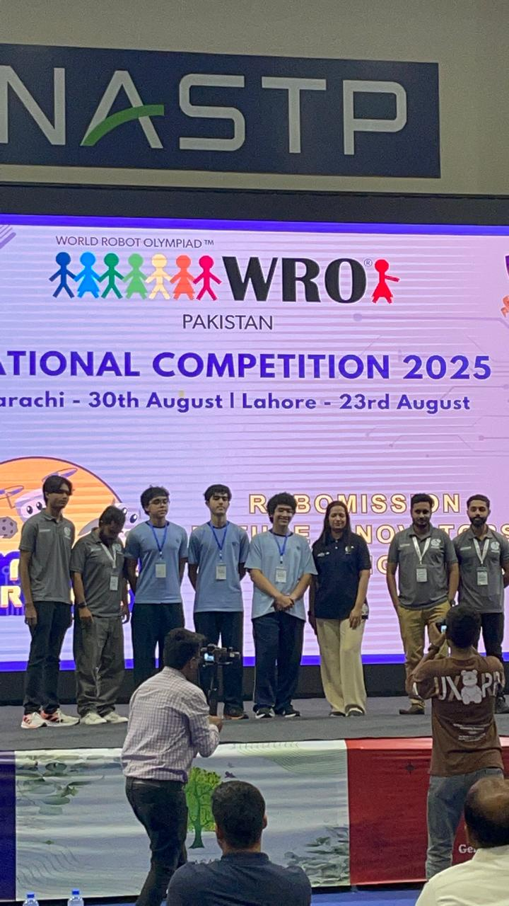
</p>


---

## Repository Quick Links

**Essential Files:**
- [Main Robot Code (Raspberry Pi)](./code/raspberry-pi/main.py)
- [XRP Controller Code](./code/xrp-board/xrp_main.py)
- [3D Model Files (STL)](./3d-models/)
- [Circuit Diagram](./electrical-diagram/delta-bot-circuit.png)
- [Construction Guide](#robot-construction-guide)
- [Cost Report](#cost-report)

**Documentation:**
- [Calibration Guide](./documentation/calibration-guide.md)
- [Troubleshooting Guide](./documentation/troubleshooting.md)
- [Competition Checklist](./documentation/competition-checklist.md)

**Media:**
- [Robot Photos](./robot-photos/)
- [Performance Videos](./testing-videos/)
- [Team Photos](./team-photos/)

---

## Version History

**v1.0.0** - January 2025
- Initial release for WRO 2025 International Competition
- Complete documentation of Delta Bot design
- All code, CAD files, and technical specifications included
- National competition 3rd place configuration

**v0.4.0** - December 2024  
- Fourth iteration (competition version)
- Raspberry Pi 5 integration
- Complete LiDAR mapping system
- Obstacle avoidance refined

**v0.3.0** - November 2024
- Third iteration
- Switched to Raspberry Pi 5
- Resolved camera and LiDAR processing issues

**v0.2.0** - October 2024
- Second iteration with Raspberry Pi 4
- LiDAR integration attempted
- Camera communication issues identified

**v0.1.0** - September 2024
- First iteration with Arduino Uno
- Basic ultrasonic navigation
- Identified need for better processing power

---

## Changelog


**Future Updates:**
- [ ] Add parking challenge improvements
- [ ] Optimize turning algorithms
- [ ] Add machine learning obstacle detection
- [ ] Create video tutorials for construction
- [ ] Add simulation environment setup guide
- [ ] Publish competition performance analysis

---

## FAQ

**Q: Can I use this design for my WRO team?**  
A: Absolutely! That's why we made it open source. Feel free to use, modify, and improve upon our design.

**Q: What's the minimum budget to replicate this robot?**  
A: Approximately 1,300 CAD (~$950 USD) for all components, excluding tools. See [Cost Report](#cost-report) for details.

**Q: Why Raspberry Pi 5 instead of Arduino or Pi 4?**  
A: We tried both! Arduino lacks camera support and processing power. Pi 4 couldn't handle LiDAR data in real-time. Pi 5's quad-core 2.4GHz processor was essential for our multi-sensor approach.

**Q: How long did it take to build?**  
A: Six months from first concept to national competition, including four major design iterations.

**Q: What's the hardest part of this project?**  
A: Sensor fusion—combining LiDAR, camera, IMU, and encoder data into coherent decisions. Also, the parking challenge (still working on it!).

**Q: Can this robot work outdoors?**  
A: Not reliably. Camera color detection is very sensitive to lighting. It's optimized for indoor competition lighting.

**Q: What programming experience is needed?**  
A: Intermediate Python (OpenCV, NumPy, object-oriented programming) and basic MicroPython. Our code is well-commented to help learners.

**Q: Why not use ROS (Robot Operating System)?**  
A: ROS is powerful but adds complexity. For WRO's focused tasks, our custom Python architecture was simpler and more performant.

**Q: How can I contribute to this project?**  
A: Fork the repository, make improvements, and submit pull requests! We especially welcome parking challenge improvements and code optimizations.

**Q: Where can I buy the components in Pakistan?**  
A: Most electronics are available from local suppliers in Karachi or online through Daraz.pk. Some specialized items (RPLidar, Raspberry Pi 5) may need to be imported.

---

<p align="center">
  ⭐ If this documentation helped you, please give us a star on GitHub! ⭐
</p>

<p align="center">
  <i>Built with passion in Karachi 🇵🇰 | Competing for the world 🌍</i>
</p>

---

**Last Updated:** January 2025  
**Repository:** github.com/[your-username]/delta-bot-wro2025  
**Competition:** WRO 2025 Future Engineers International  
**Team:** Delta K - Kabir, Kosain, Rayyan  
**Coach:** Ali Saif  
**School:** Haque Academy, Karachi, Pakistan

---

